# Incorrect DNS Server

## Problem

PC1 cannot reach the domain controller or domain resources because it is using the wrong DNS server.

## Symptoms

- nslookup dc1.martinlab.local fails.
- ping dc1 fails.
- Group Policy errors.

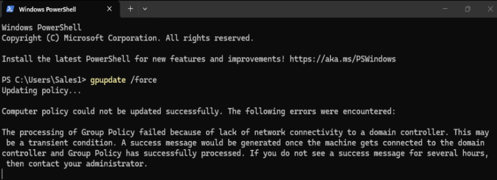

- Logon delays.
- SMB paths like \\fileserver works but asks for credentials.

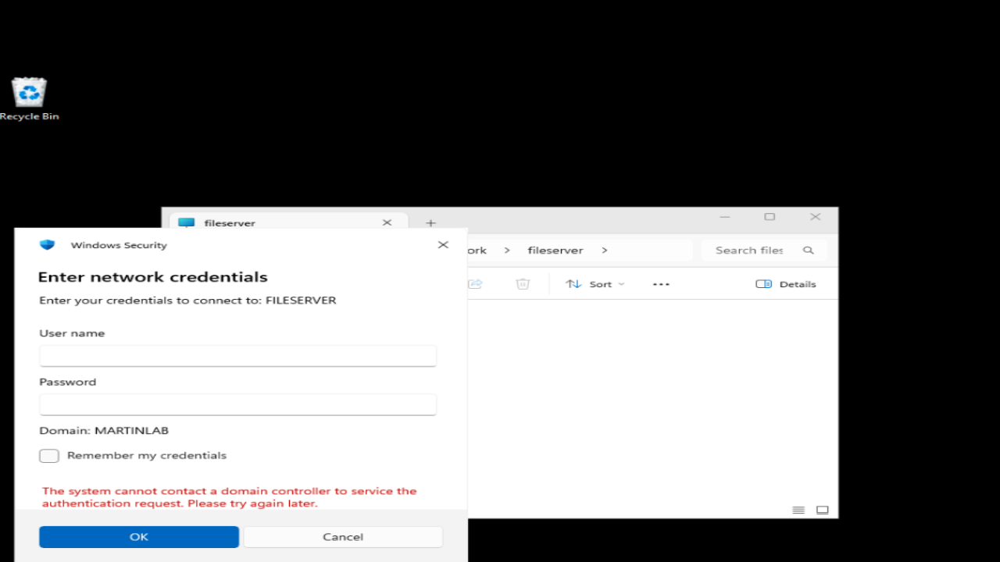

- Wallpaper GPO is disabled and it is a black solid color.
- Event Viewer errors.

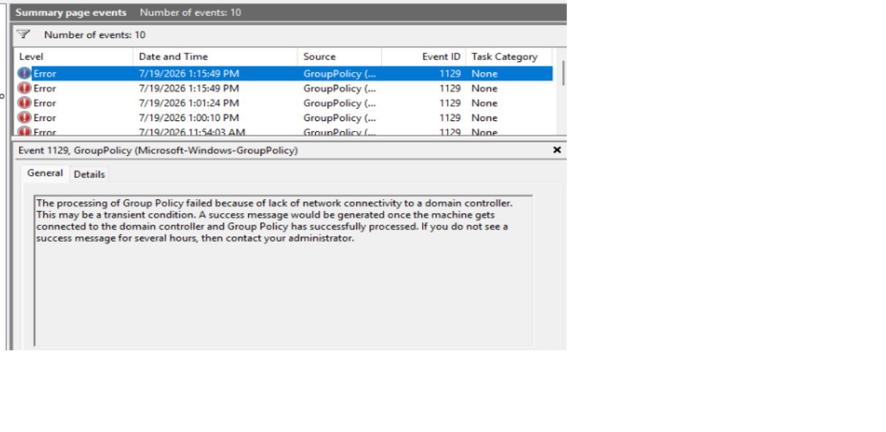

## Investigation

1. Ran the following 3 commands on PowerShell:
```
nslookup dc1.martinlab.local = Failure
ping dc1.martinlab.local = Failure.
ping 192.168.100.10 = Successful.
```

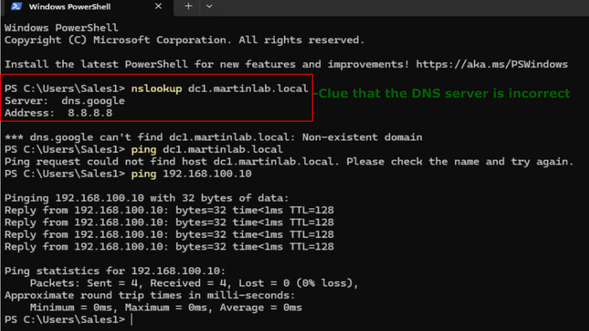

2. Ran the next command: ipconfig /all
3. Noticed the DNS server is incorrect.

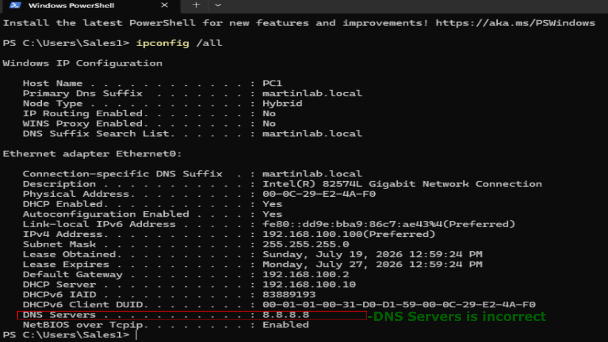

4. Ran the next command: ipconfig /displaydns
5. Noticed FILESERVER appears but not DC1.

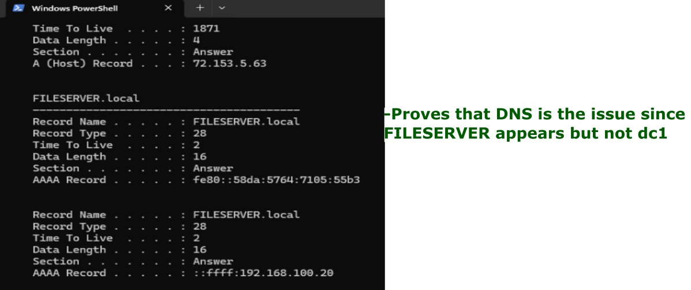

6. Ran the next two commands to test if there is a bad cache entry:
``` 
ipconfig /flushdns
nslookup dc1.martinlab.local = Failure.
```

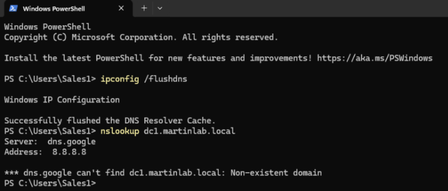

7. On Domain Controller 1, Navigated to: Server Manager -> DNS -> Forward Lookup Zones -> martinlab.local.
8. Confirmed A record for dc1.martinlab.local
9. Navigated to _msdcs, and confirmed SRV records.

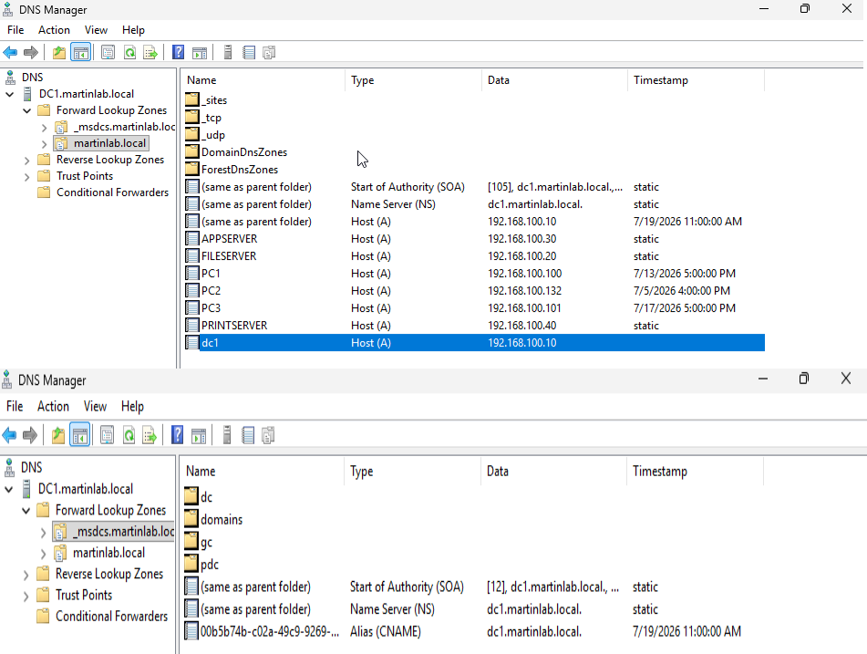

## Root Cause

PC1 is using an incorrect DNS server, so it cannot resolve domain resources.

## Resolution

1. On PC1, navigated to: Windows -> View Network Connections -> Ethernet0 -> Properties -> TCP/IPv4
2. Changed the 'Preferred DNS Server' to 192.168.100.10
3. Clicked Ok.

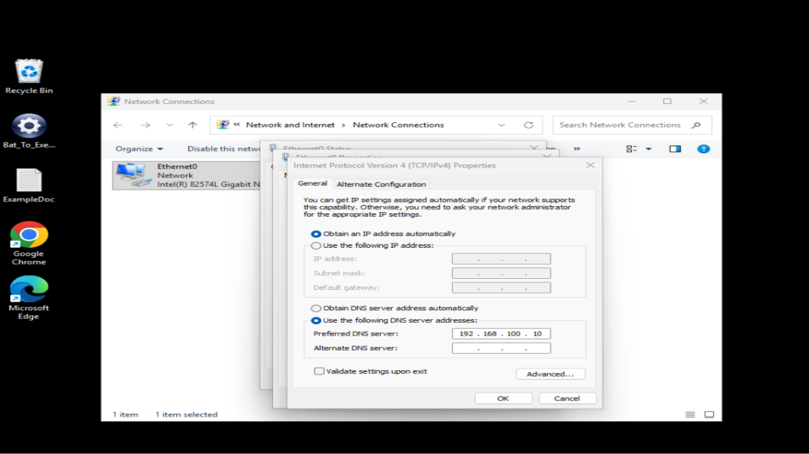

4. Restarted PC1.

## Verification

- nslookup and ping work successfully.

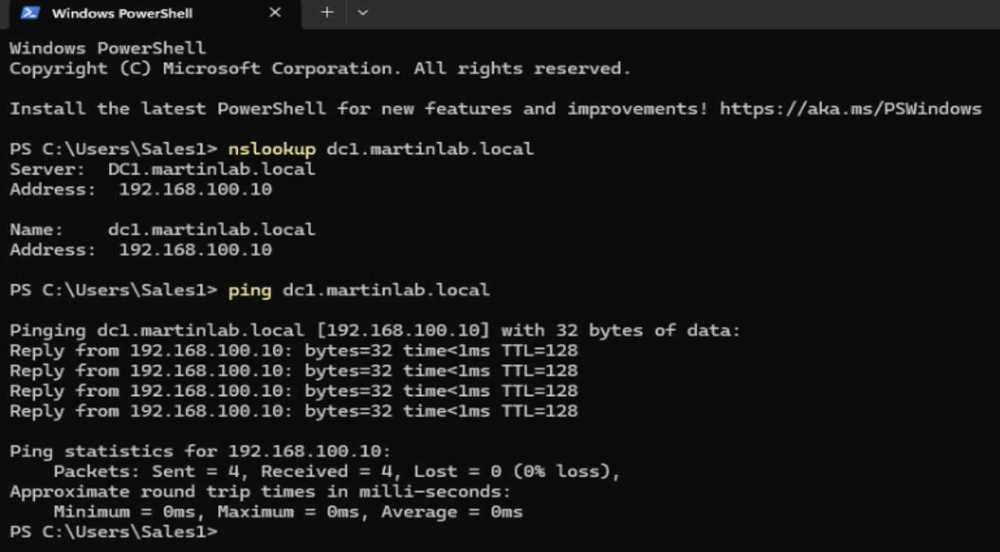


- GPO updates apply successfully.

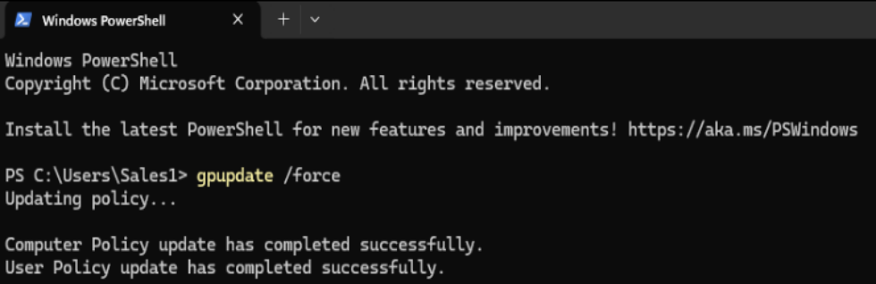

- Domain resources are accessible without a verified login.

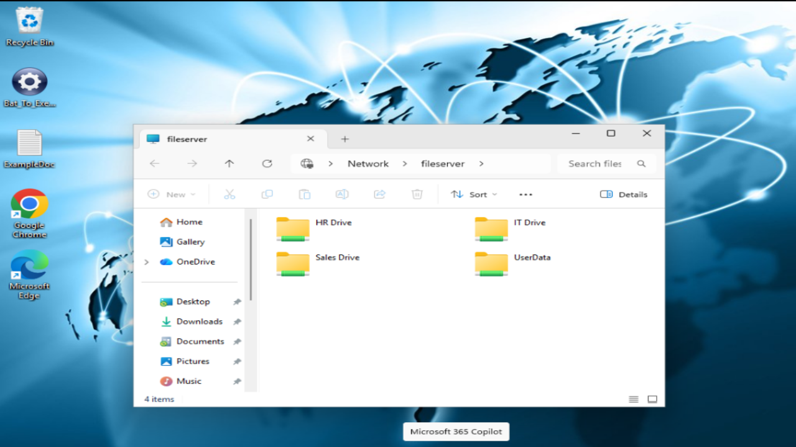

- GPO background is applied.


