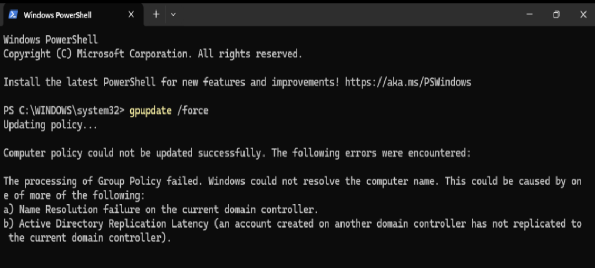
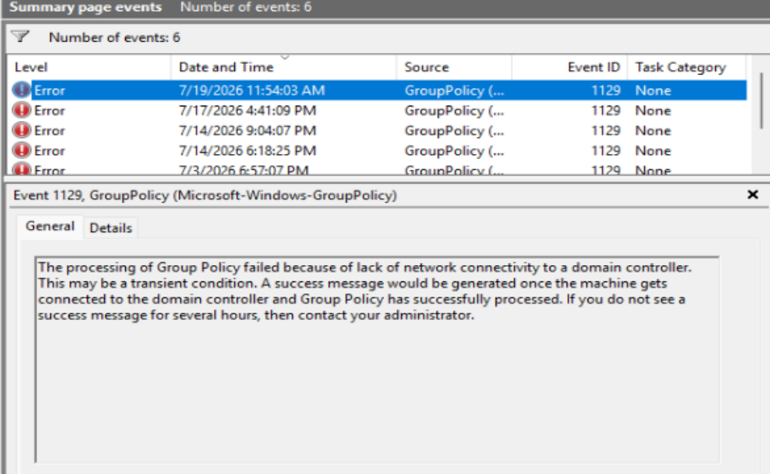
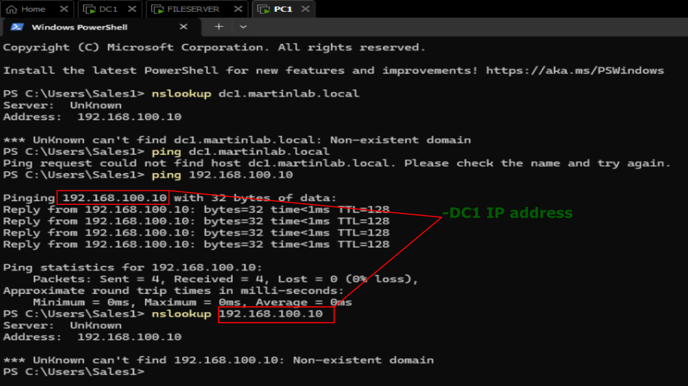
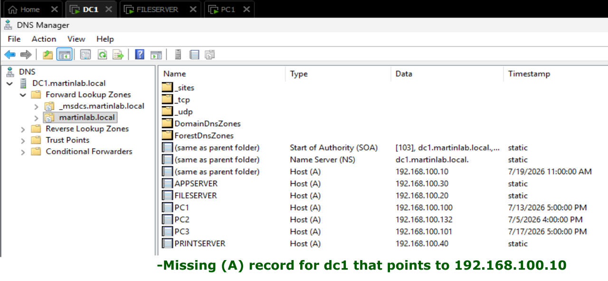
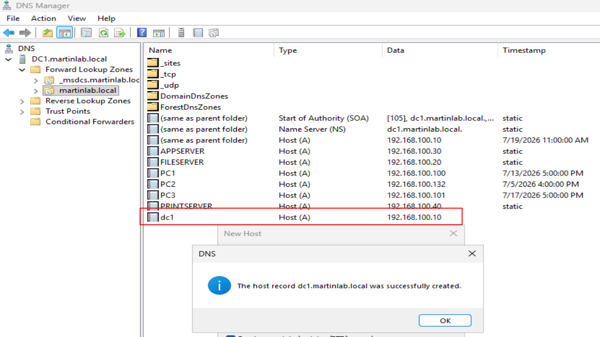
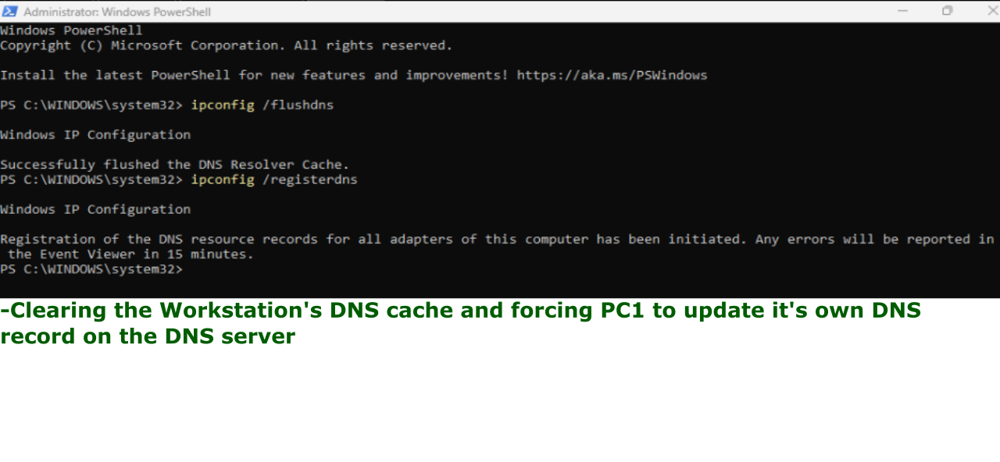
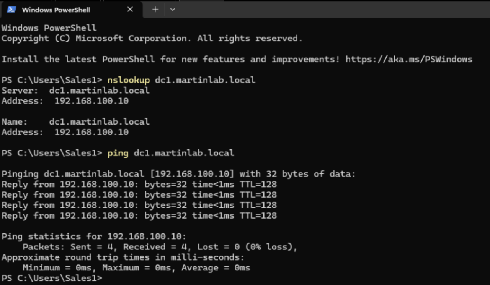
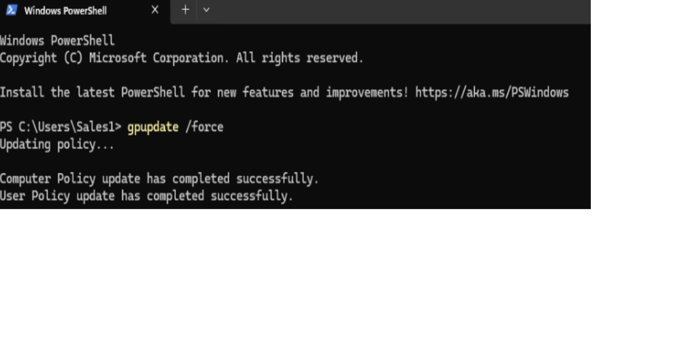

# Missing A Record

## Problem

A workstation cannot resolve the domain controller's hostname because the DNS A record is missing.

## Symptoms

- nslookup dc1.martinlab.local fails.
- ping by hostname fails.
- Domain join fails with "The domain controller could not be contacted."
- GPO fails.



- Event Viewer shows DNS lookup failures.



## Investigation

1. On PC1 logged in as Sales1 user, ran the following 4 commands on PowerShell:
```
nslookup dc1.martinlab.local = unknown
ping dc1.martinlab.local = could not find host
ping 192.168.100.10 = Successful
nslookup 192.168.100.10 = unknown
```



2. On Domain Controller 1, navigated to: Server Manager -> DNS -> Forward Lookup Zones -> martinlab.local.
3. Noticed there is no (A) record for dc1.



## Commands Used
```
nslookup dc1.martinlab.local
nslookup 192.168.100.10
ping dc1.martinlab.local
ping 192.168.100.10
ipconfig /flushdns
ipconfig /registerdns
```

## Root Cause

The DNS (A) record for dc1 was missing or deleted, causing clients to fail hostname resolution.

## Resolution

1. Still on martinlab.local, clicked 'New Host (A or AAAA).
2. Inputted 'dc1' as the Name and '192.168.100.10' as the IP address.
3. Selected the option to 'Create associated pointer (PTR) record.'
4. Clicked on 'Add Host.'



5. On PC1, ran the following 2 commands on PowerShell: 
```
ipconfig /flushdns
ipconfig /registerdns
```



## Verification

- Ran the following 2 previous commands that failed on PowerShell:
```
nslookup dc1.martinlab.local = Successful
ping dc1.martinlab.local = Successful
```



- Updating Group Policy is successful.
- Event Viewer shows no errors.
- Domain Join is successful.


