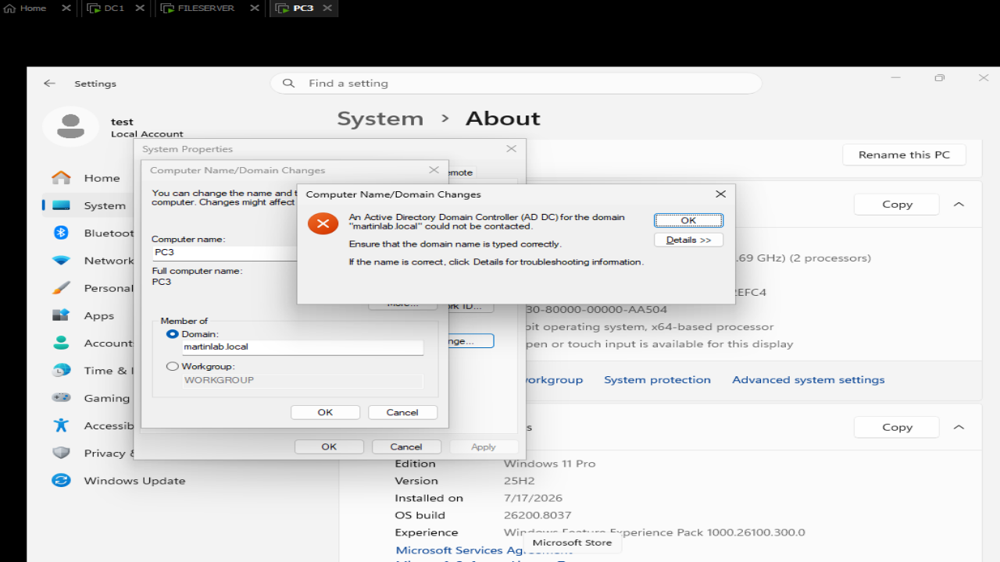
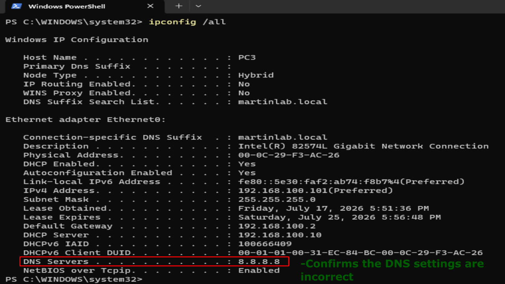
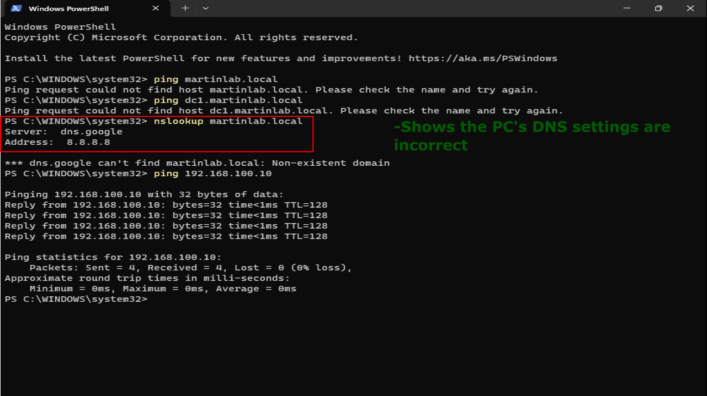
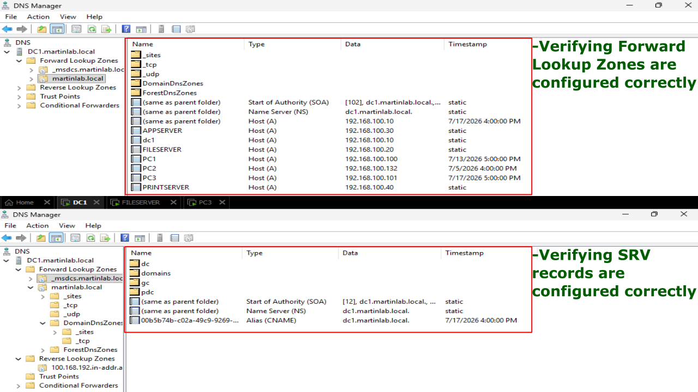
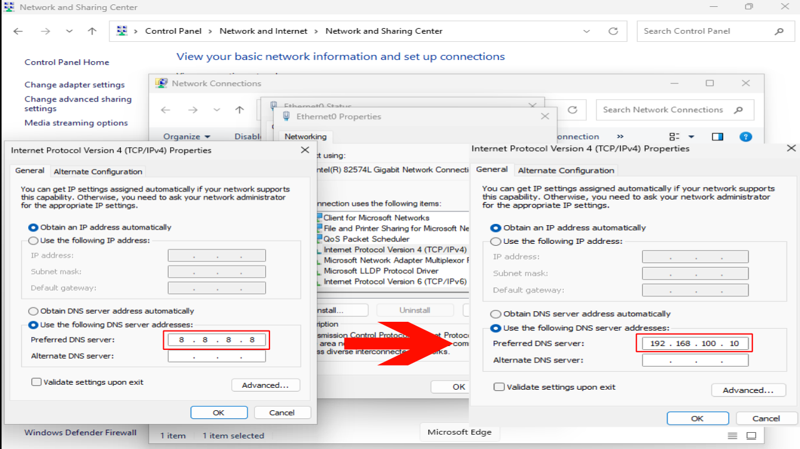
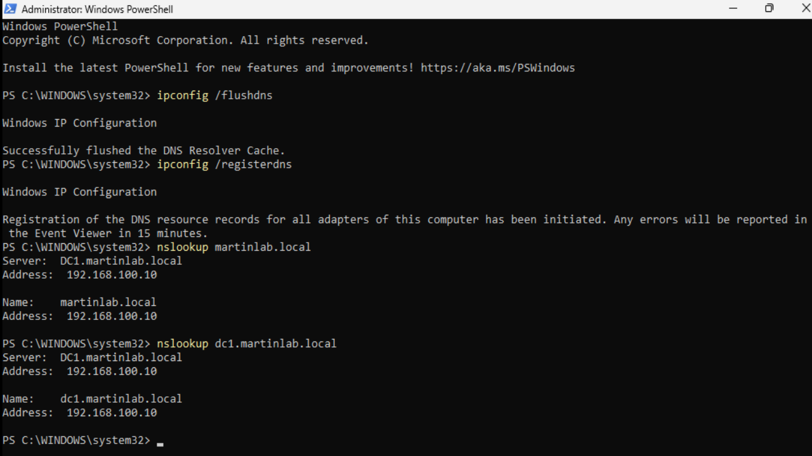
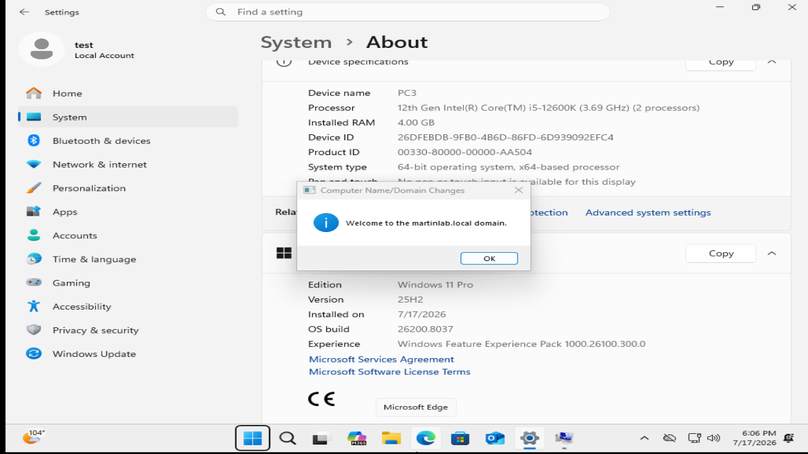
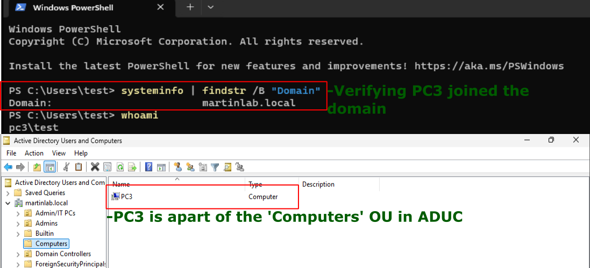

# Incorrect DNS Domain Join

## Problem

A workstation cannot join the domain because it is using an incorrect DNS server. Windows domain joining requires the client to use the domain controller’s DNS — not Google DNS, not the router, not DHCP defaults.

## Symptoms

- Domain join faills with: "The domain name cannot be contacted"
- Ping martinlab.local fails or resolves the wrong IP.
- nslookup martinlab.local returns with non-existent domain and timeout.
- Workstation can reach the DC by IP, but not by name.
- Event Viewer shows no NETLOGON error.



## Investigation

1. Checked workstation DNS settings by running ipconfig /all.
2. Noticed the DNS server is incorrect.



3. Tested name resolution by running: nslookup martinlab.local and nslookup dc1.martinlab.local.
  - Expected failure.
4. Tested connectivity by running: ping dc1.martinlab.local and ping martinlab.local.
  - Expected failure.



5. Validated DC DNS by ensuring A records exist and SRV records.



## Commands Used
```
ipconfig /all
ping
nslookup
system info | findstr /B "domain"
```

## Root Cause

The workstation is using incorrect DNS servers, preventing it from locating the domain controller’s SRV records required for domain joining.

## Resolution

1. Set workstation DNS to the correct domain controller by navigating to: Control Panel -> Network and Internet -> Network and Sharing -> Adapter Settings -> Ethernet0 -> Properties -> TCP/IPv4 -> DNS



2. Flushed the DNS by running: ipconfig /flushdns and ipconfig /registerdns.
3. Tested name resolution again by running nslookup martinlab.local and dc1.martinlab.local.



4. Joined the domain.



## Verification

- Successful domain join.
- Corrected DNS settings.
- Event Viewer clean.
- ADUC shows PC3 under Computers.


