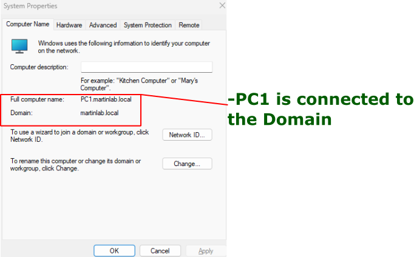
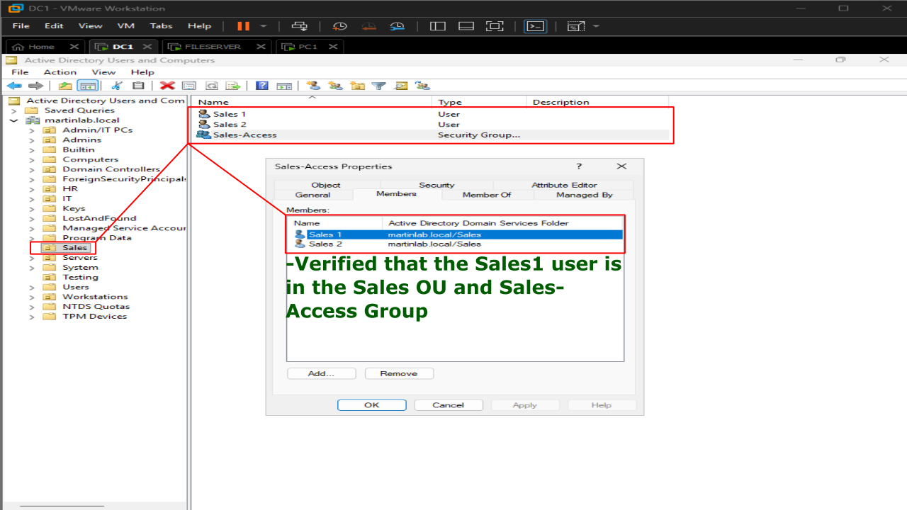
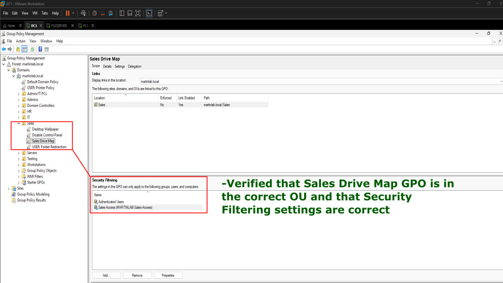
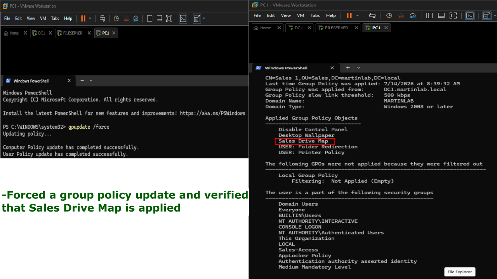
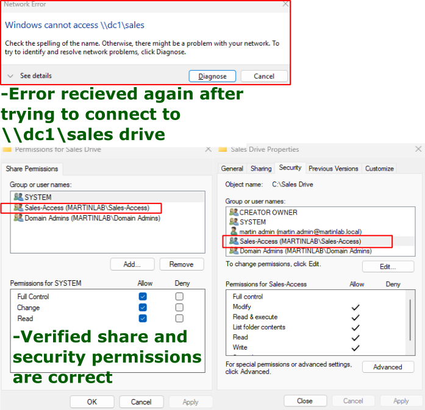
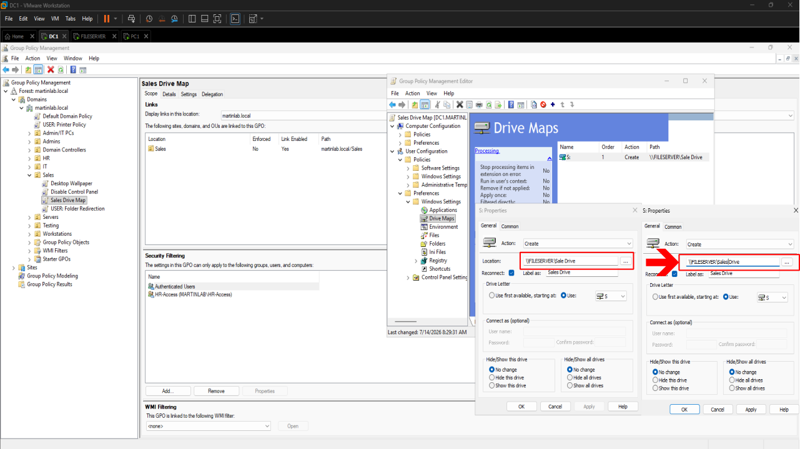
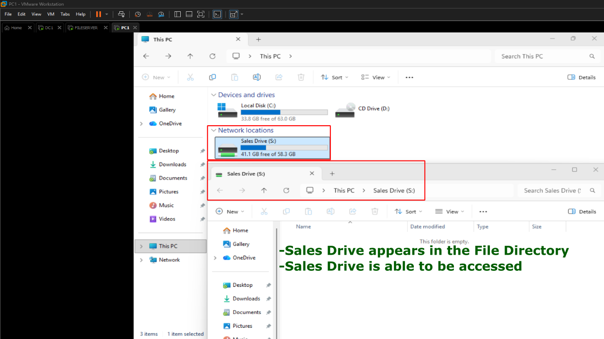

# Broken Network Drive Mapping Troubleshooting Lab

# Problem

A mapped network drive that should automatically appear for domain users was missing after logon. Users were unable to access the shared folder used for departmental files.

# Symptoms

- Expected mapped drive does not appear in File Explorer.
- Users receive **"Windows cannot access the specified network location"** or **"The network path was not found."**
- Shared folder is unreachable through the mapped drive.
- Other domain resources continue to function normally.

!(FileShares-MappedDrives](screenshots/DMM-1.png)

# Investigation

(Sales1 user will be used that is a part of the Sales OU and Sales-Access group.)

1. Verified the client was joined to the domain.



2. Confirmed the user account was located in the correct Organizational Unit.



3. Checked whether the Drive Mapping Group Policy Object was applied.



4. Ran the following two commands on PowerShell:
```
gpupdate /force
gpresult /r
```


6. Attempted to access the share directly: \\DC1\Sales
7. Verified the shared folder still existed and NTFS/share permissions were correct.



8. Opened **Group Policy Management** and reviewed the Drive Maps preference.
9. Noticed the location of the drive was inputted incorrectly.

# Commands Used

```powershell
gpupdate /force
gpresult /r
```

# Root Cause

The mapped drive in the Group Policy Preferences was configured with an **incorrect network path**, preventing Windows from creating the drive mapping during user logon.

# Resolution

1. Opened **Group Policy Management**.
2. Edited the Drive Maps preference.
3. Corrected the UNC path to the shared folder.
4. Saved the policy.



5. Ran:
   ```
   gpupdate /force
   ```
6. Logged off and back on.

# Verification

- The mapped drive appeared automatically in File Explorer.
- Users successfully opened the shared folder.
- Files could be created, modified, and deleted according to assigned permissions.
- `gpresult /r` confirmed the Drive Mapping GPO was successfully applied.


