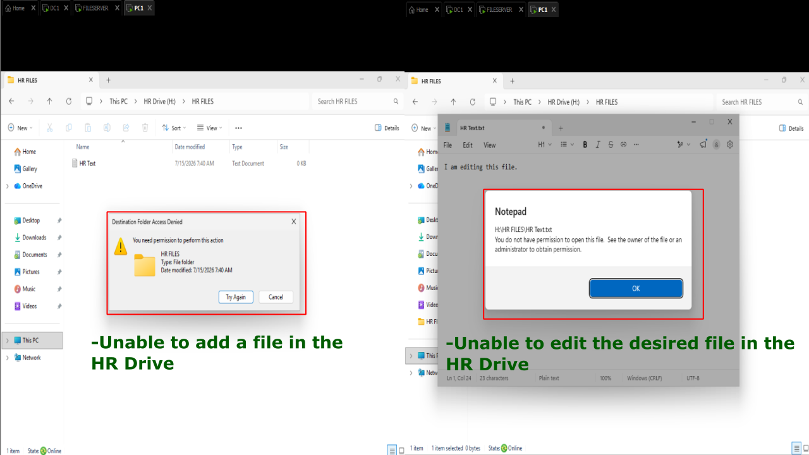
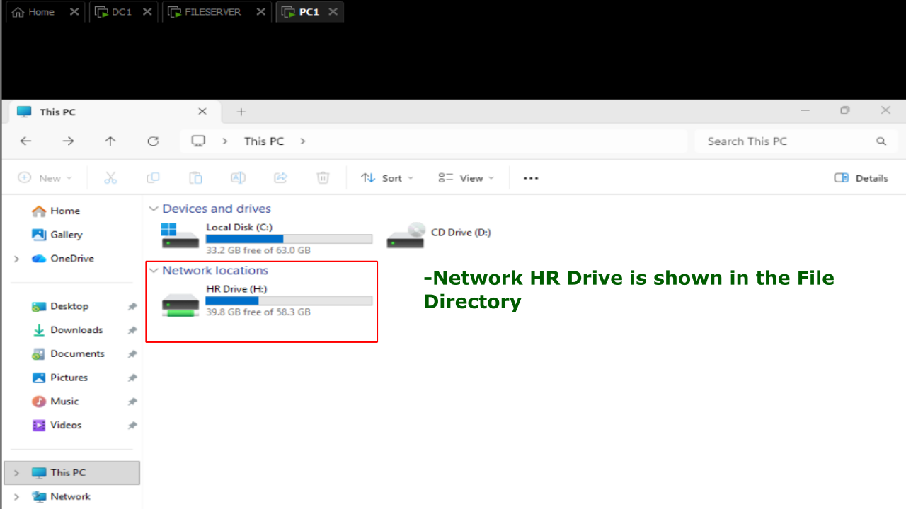
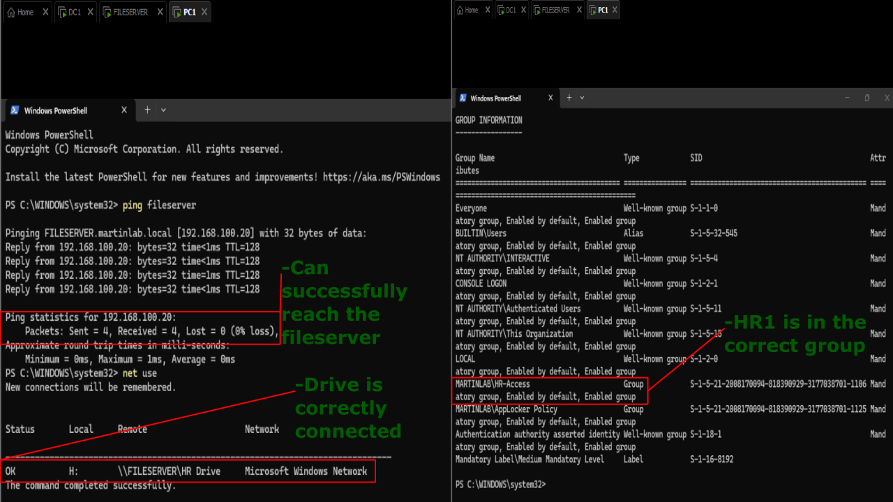
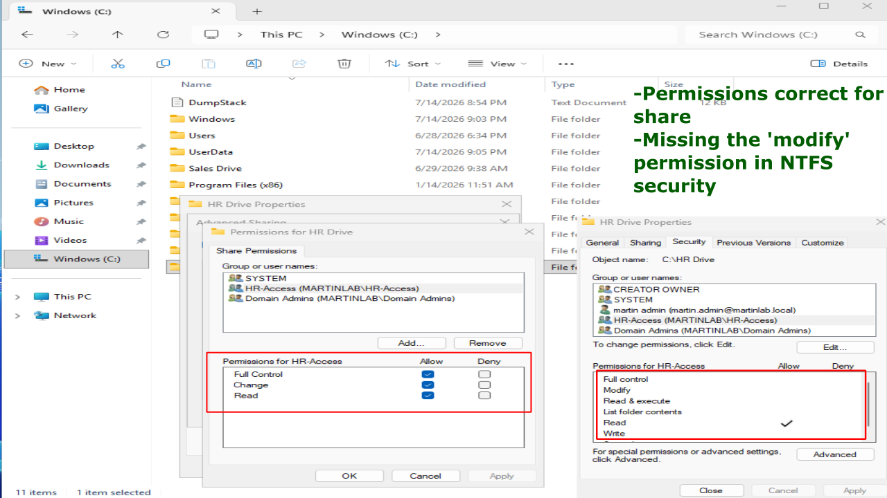
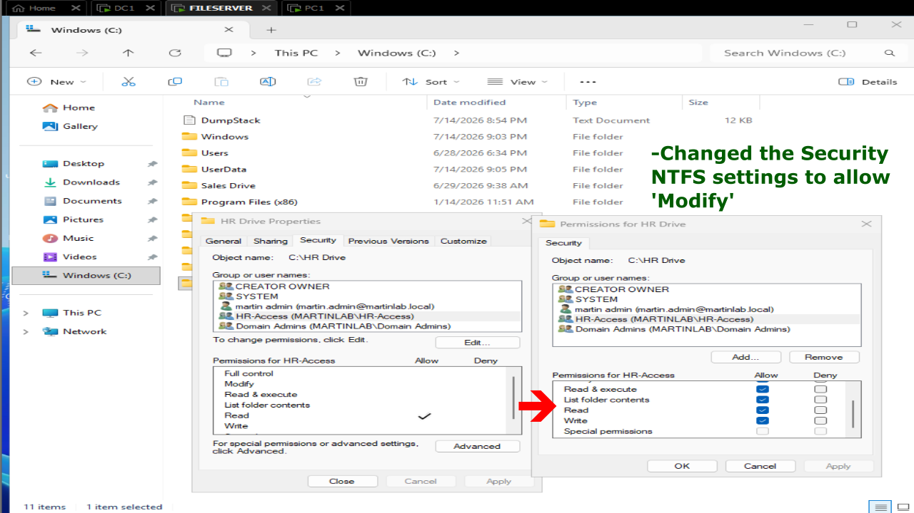
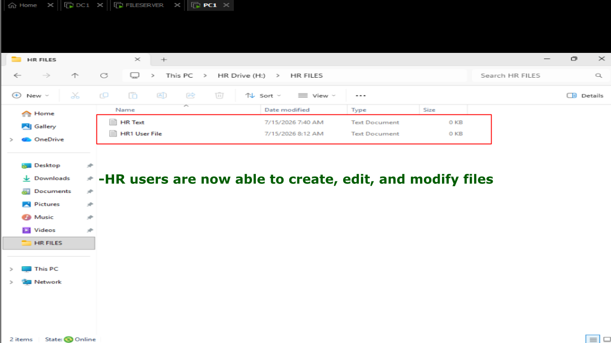

# NTFS Permissions Conflict

## Problem

The HR users are able to access the shared folder on the network, but receives an "Access is denied" error when attempting to open, modify, or create files. The network share appears correctly, but permissions prevent HR users from accessing its contents.

## Symptoms

- Shared folder is visble in File Explorer.
- Mapped drives connects successfully.
- User cannot create, edit, or delete files.
- Other users with different permissions can access the share normally.



## Investigation

1. Logged in as HR1 user on PC1.
2. Verified the shared folder was online and accessible from the network.



3. Confirmed the mapped drive connected successfully.
4. Tested connectivity to the file server.
5. Verified HR1 was in the 'HR-Access' group.



6. On 'FILESERVER' navigated to: C:\HR Drive -> Properties -> Sharing -> Advanced Sharing -> Properties
7. Verified the 'HR-Access' group had full control permissions of drive.
8. Navigated to Security Tab nad noticed the 'HR-Access' group only had 'Read' permissions.



9. Determined that Share Permissions allowed access, but NTFS permissions denied it.
10. Verified that NTFS permissions are the most restrictive when combined with Share Permissions.

## Commands Used
```
ping fileserver
net use
whoami /groups
```

## Root Cause

The HR users security group had 'Read' permission through the Share Permissions, but an incorrect NTFS permission removed 'Modify.' Since effective permissions are the combination of Share and NTFS permissions, the NTFS restriction prevented access.

## Resolution

1. Still on FILESERVER, navigated to the Security Tab on the HR Drive.
2. Edited the 'HR-Access' permissions to include modify.
3. Applied the settings.



## Verification

- User successfully opened the shared folder.
- User created a test file.
- User edited the test file.
- User deleted the test file (if Modify permission was expected).
- Verified the mapped drive functioned normally without Access Denied errors.
- Confirmed permissions using on PowerShell: icacls "D:\\fileserver\HR Drive"



