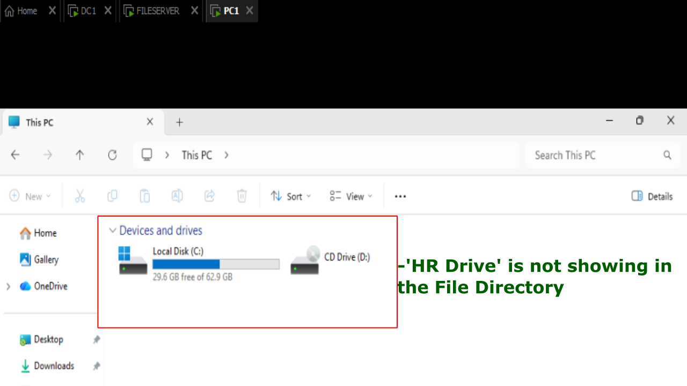
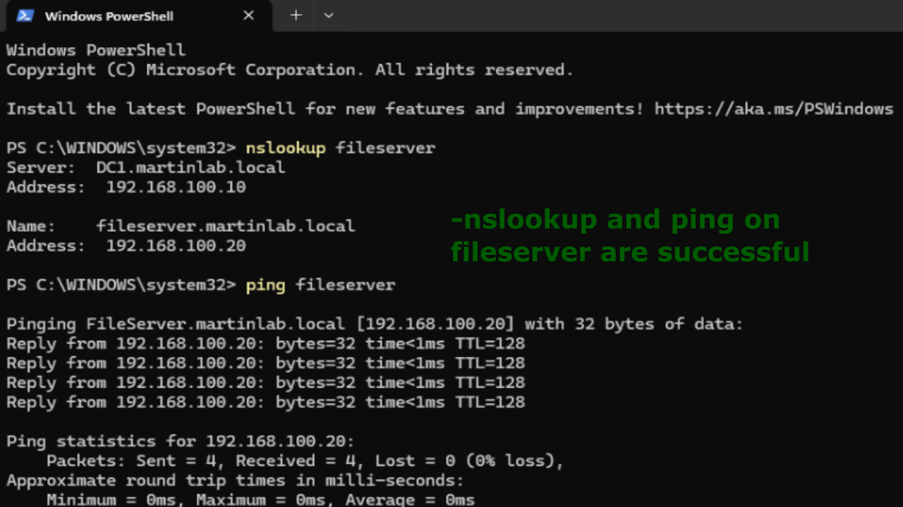
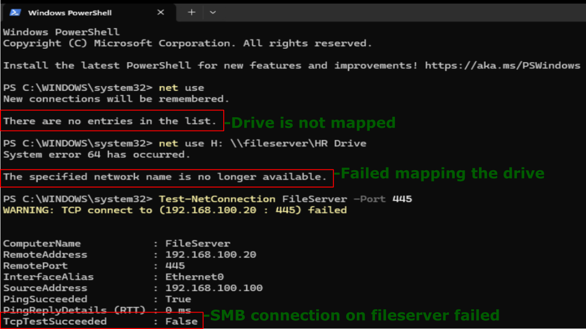
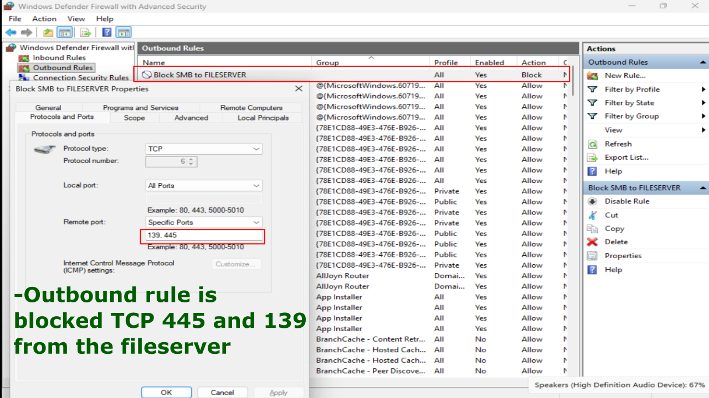
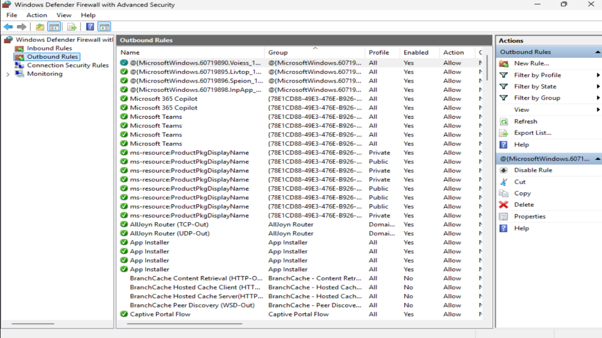
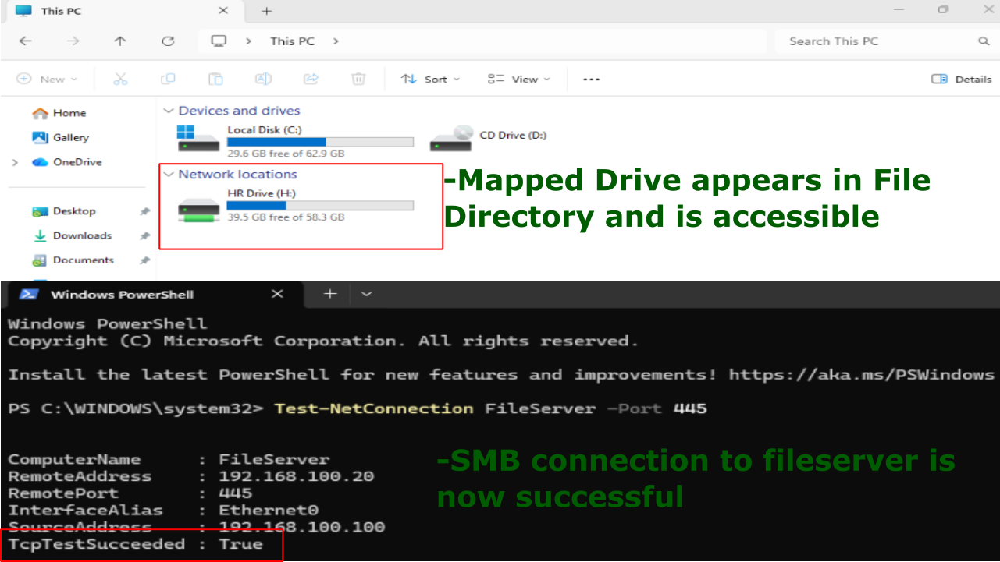

# SMB/File Sharing Firewall Blocked

## Problem

HR users are unable to access a shared folder or mapped network drive hosted on a Windows File Server. Although the server is online and reachable over the network, attempts to browse or map the share fail because the Windows Defender Firewall is blocking SMB traffic.

## Symptoms 

- HR Users cannot open \\FileServer\HR Drive.
- Existing mapped drives show a red X.
- "The network path was not found"
- Server responds to ping.
- RDP to the server still works.
- DNS resolution is successful.



## Investigation

1. From PC1, logged in as HR1 user, verified DNS by running: nslookup fileserver.
2. Verified network connectivity by running: ping fileserver.




3. Attempted to browse the share: \\fileserver\Hr Drive.
4. Checked existing mappings: net use
5. Attempted to map the drive: net use H: \\fileserver\HR Drive.
6. Tested SMB connectivity: Test-NetConnection filserver -Port 445.
7. Noticed the output was false.




8. Navigated: Windows Defender Firewall with Advanced Security -> Run as Administrator -> Outbound Rules 
9. Noticed a custom outbound rule to block SMB traffic to the fileserver.




## Commands Used
```
ping fileserver
nslookup fileserver
net use
net use H: \\fileserver\HR Drive
Test-NetConnection fileserver -Port 445
```

## Root Cause

The Windows Defender Firewall on the File Server was blocking SMB traffic by disabling the File and Printer Sharing (SMB-In) firewall rules (or blocking TCP port 445).

Although DNS resolution and basic network connectivity were functioning correctly, clients could not establish an SMB session to access shared folders or mapped drives.

## Resolution

1. In Windows Defender Firewall with Advanced Security in the Outbound Rules tab.
2. Deleted the Outbound Rule 'Block SMB to fileserver' as it was blocking ports TCP 445 and 139.
3. Logged off and logged back on to reconnect the mapped drive.




## Verification

1. Verified SMB connectivity: Test-NetConnection fileserver -Port 445.
2. Verified HR Drive was visible in File Directory and accesible.



