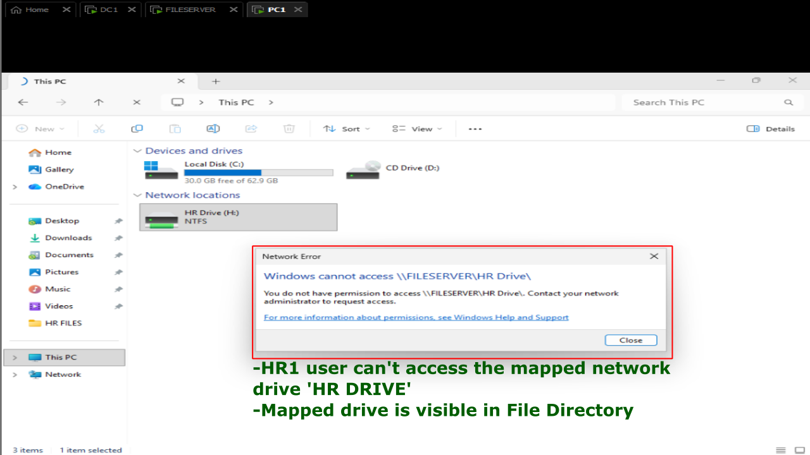
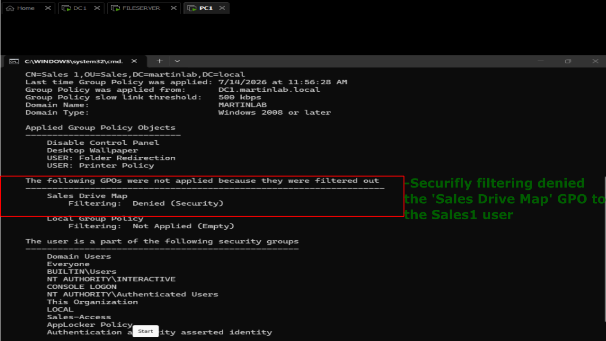
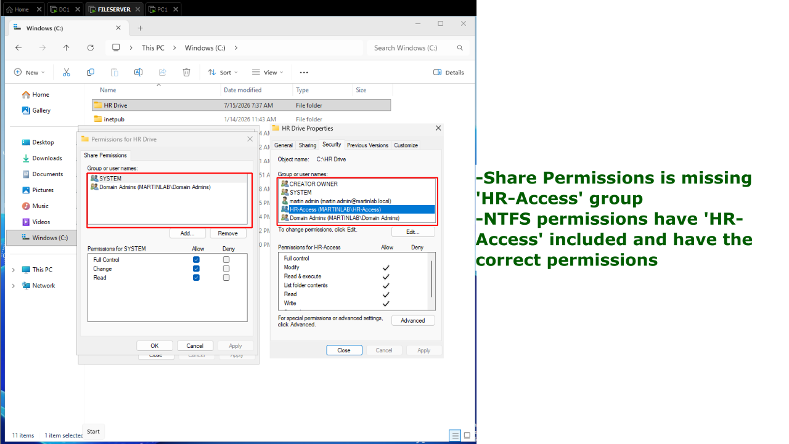
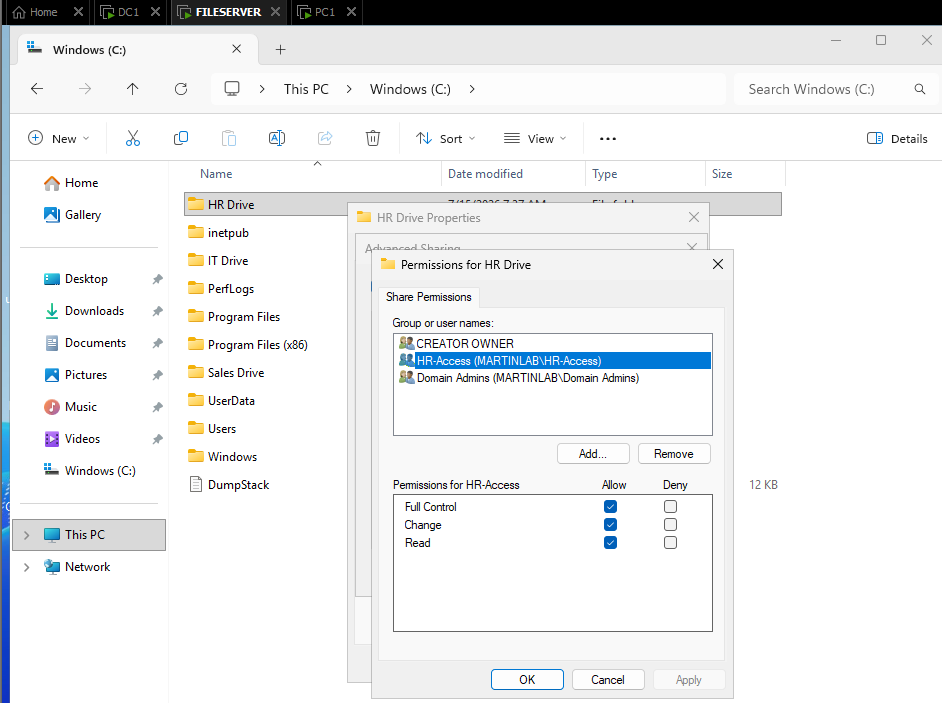
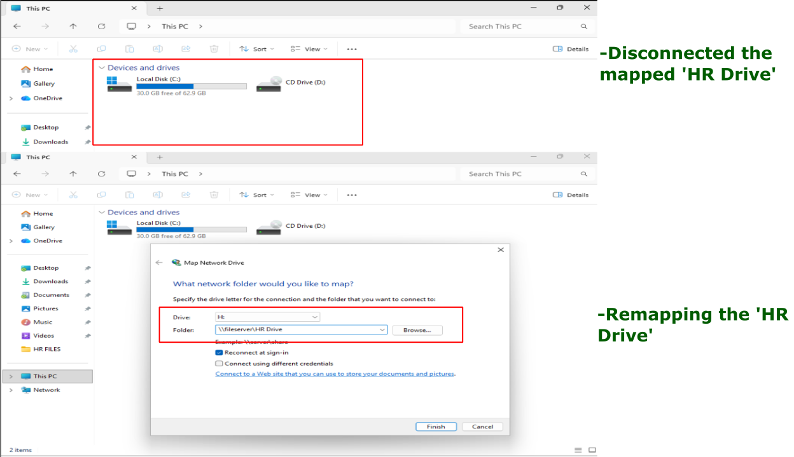
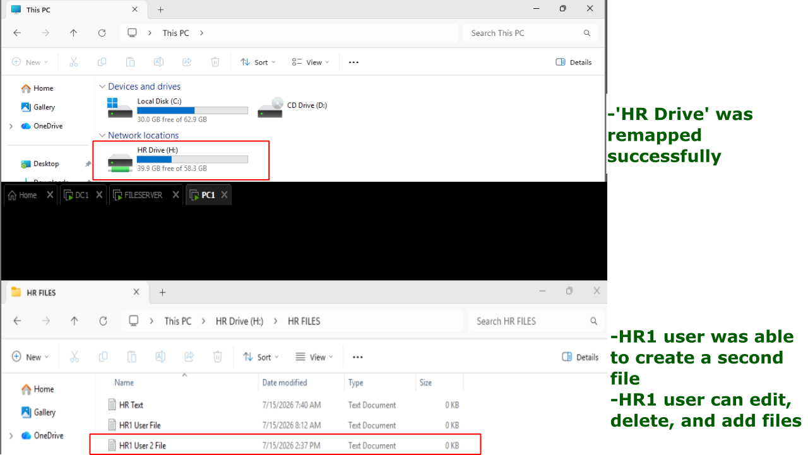

# Share Permissions Conflict

## Problem

HR users report that they cannot access a network file share or mapped drive even though they are members of the correct Active Directory security group. NTFS permissions appear to be configured correctly, but access is still denied.

## Symptoms

- "Access is denied" when opening the mapped drive
- Users can see the mapped drive but cannot open it
- Drive mapping succeeds, but the folder cannot be accessed
- Other users with different permissions may still have access



## Investigation

1. Confirmed HR1 user is a member of the correct security group by opening PowerShell and running: 'whoami /groups.'

2. Verified the drive mapping points to the correct network path by typing the command: net use



3. Checked Share Permissions on FILESERVER:
   - Right-click the shared 'HR Drive' folder.
   - Navigated: Properties -> Sharing Tab -> Advanced Sharing -> Permissions
   - Then navigated: Security Tab -> 'HR-Access'

4. Compared Share Permissions with NTFS Security permissions.

5. Noticed under the 'Sharing' Tab, 'HR-Access' was not part of the list the folder is being shared to.



## Commands Used

```powershell
whoami /groups
whoami /all
net use
```

## Root Cause

The Share Permissions were configured incorrectly by not including the 'HR-Access' group.

## Resolution

1. Open the shared folder properties.
2. Navigated: Sharing Tab -> Advanced Sharing -> Permissions
3. Configured share permissions to include 'HR-Access' for 'Read.'



## Verification

- Disconnect and reconnect the mapped drive.
- Have the affected user access the share.
- Verified the HR1 user can add, delete, and edit files.
- Confirm no "Access Denied" errors remain.



