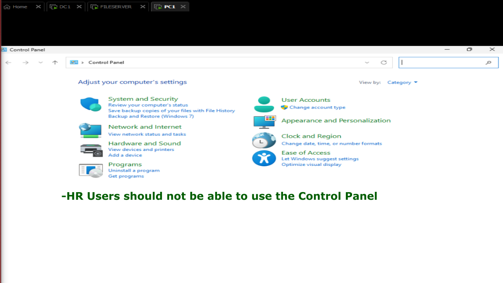
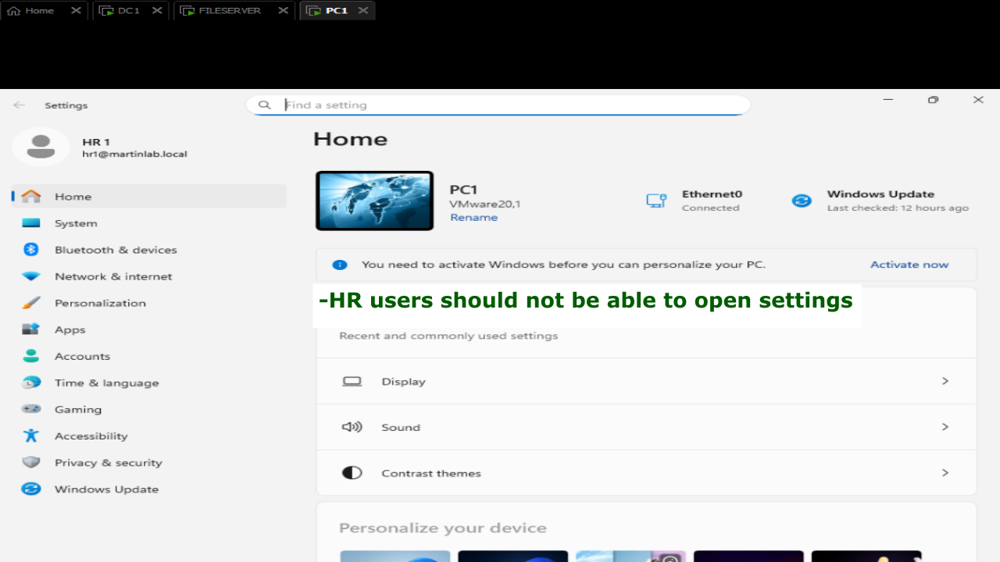
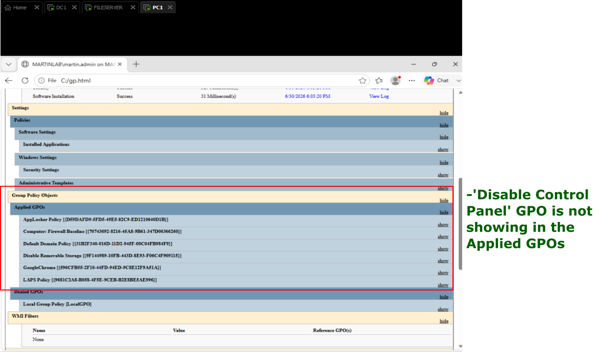
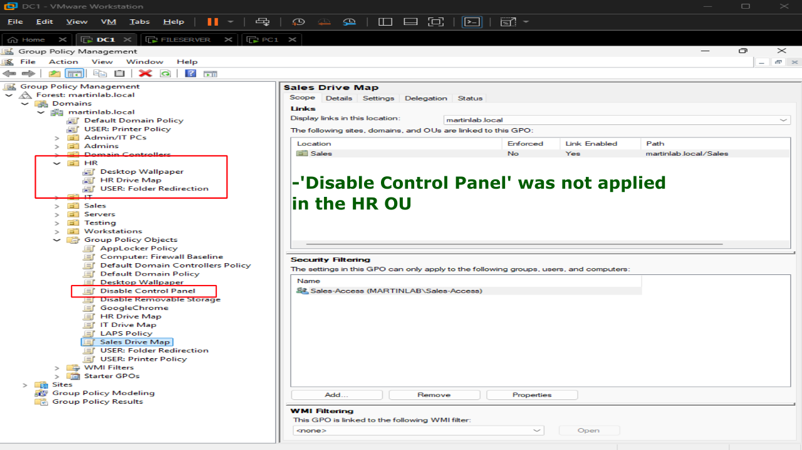
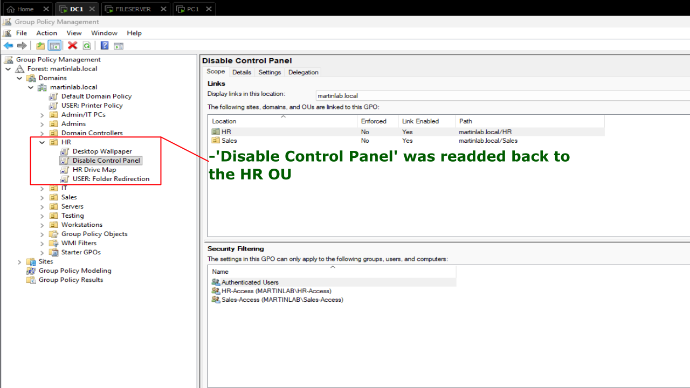
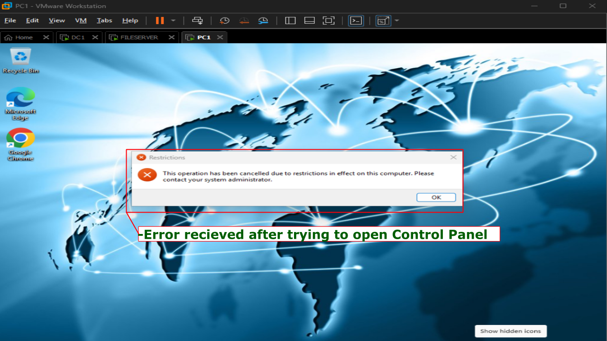
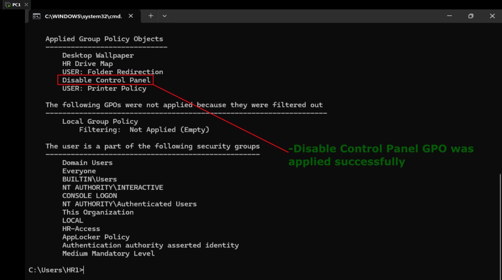

# Unlinked GPO

## Problem
A Group Policy Object (GPO) that restricted access to Control Panel and the Settings app was no longer being applied to HR users. HR Users were unexpectedly able to open and modify system settings.

## Symptoms
- Control Panel opened normally.
- The Windows Settings app was accessible.
- Expected policy restrictions were missing.
- `gpupdate /force` completfed successfully.
- No Group Policy errors were displayed during logon.



## Investigations

1. Logged on as a HR1 user.
2. Verified that Control Panel and Settings were accessible.



3. Ran `gpupdate /force`.
4. Generated a Group Policy Results report using `gpresult`.
5. Noticed the **Control Panel Restrictions** GPO was missing from the list of applied policies.



6. On Domain Controller, opened Group Policy Management.
7. Navigated to the Users OU.
8. Discovered that the GPO had been unlinked from the Organizational Unit.



## Commands Used

```powershell
gpupdate /force

gpresult /r

gpresult /h C:\Temp\GPReport.html
```

## Root Cause

The **Control Panel Restrictions** GPO was no longer linked to the Organizational Unit containing the domain users. Since the GPO link was removed, the User Configuration settings were never processed during Group Policy refresh.

## Resolution

1. Open **Group Policy Management (gpmc.msc)**.
2. Navigate to the OU containing the target users.
3. Right-click the OU and select **Link an Existing GPO**.
4. Select the **Control Panel Restrictions** GPO.
5. Confirm the GPO is linked and enabled.
6. On the client computer, run:

```powershell
gpupdate /force
```



## Verification

- `gpresult /r` listed the **Control Panel Restrictions** GPO under **Applied Group Policy Objects**.
- Attempting to open Control Panel displayed the configured restriction message.
- The Settings app was also blocked according to the policy.
- Group Policy applied successfully without errors.



