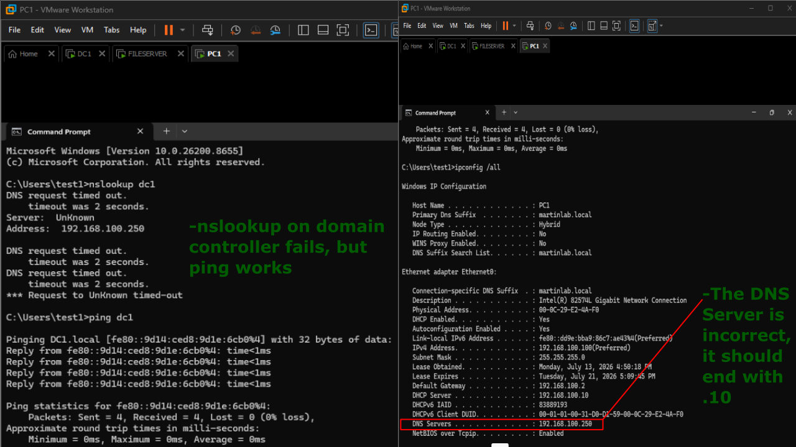
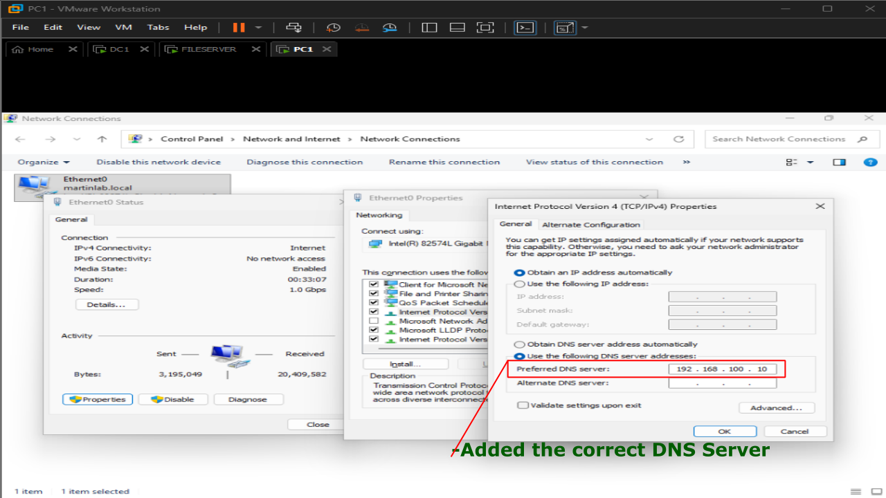
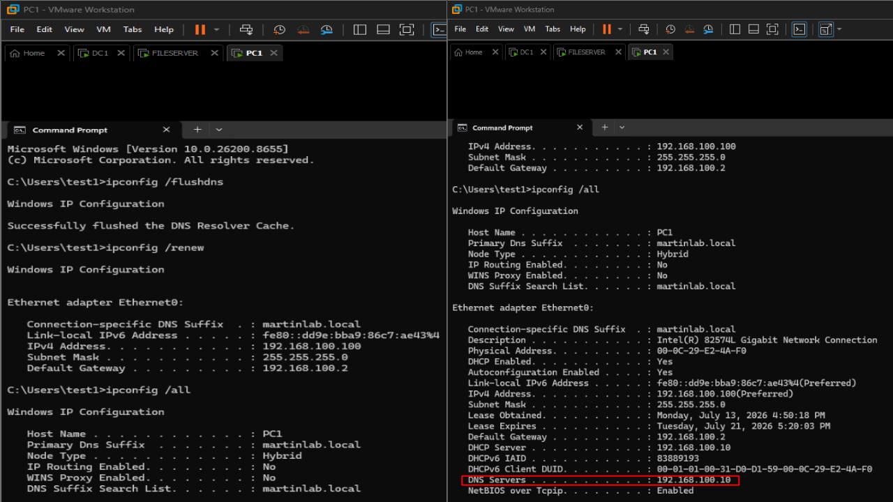
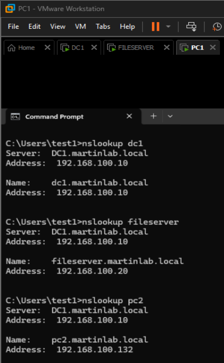

# Incorrect DNS Server

## Problem

A Windows 11 client was unable to access websites or domain resources because it was configured with an incorrect DNS server address.

## Symptoms

- Internet websites would not load.
- nslookup dc1 failed.
- Domain resources could not be located.
- ping dc1 was successful. indicating basic network connectivity.

## Investigation

1. On CMD, ran the following three commands:
```
nslookup dc1
ping dc1
ipconfig /all
```
2. nslookup failed, but ping worked.
3. Noticed the incorrect DNS Server being used in the TCP/IP configurations. 



## Commands Used

```cmd
ipconfig /all
nslookup dc1
ping dc1
ipconfig /flushdns 
ipconfig /renew
```

## Root Cause

The client was configured with an incorrect DNS server address, preventing hostname resolution.

## Resolution

Updated the preferred DNS Server to the correct internal DNS server provided by the Domain Controller by navigating to: Network and Internet -> Network & Sharing Center -> Change Adapter Settings -> Properties -> Internet Protocol Version 4 (TCP/IPv4)



## Verification

- Successfully resolved hostnames using 'nslookup'
- Internet browsing functionality was restored.
- Domain resources were accessible again.



