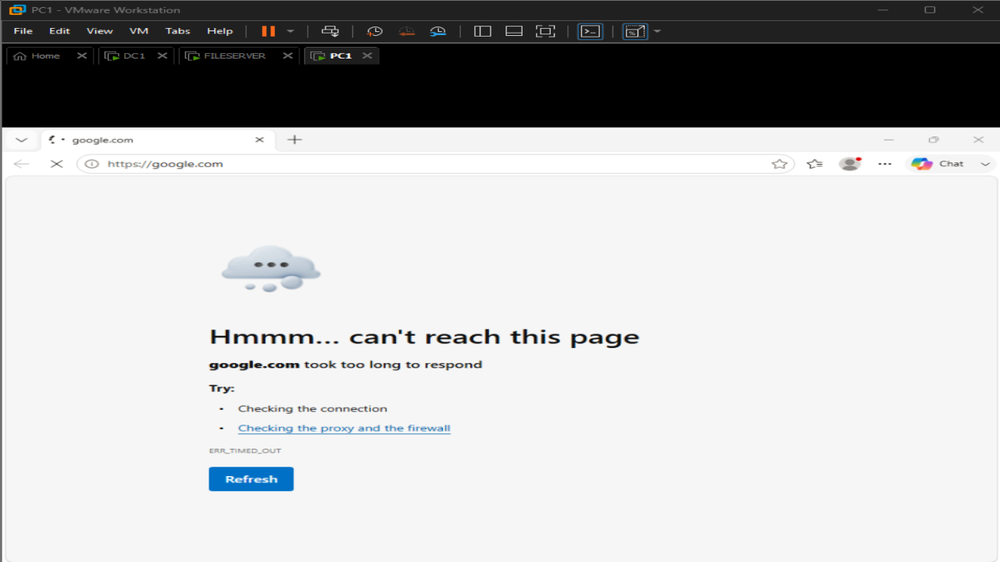
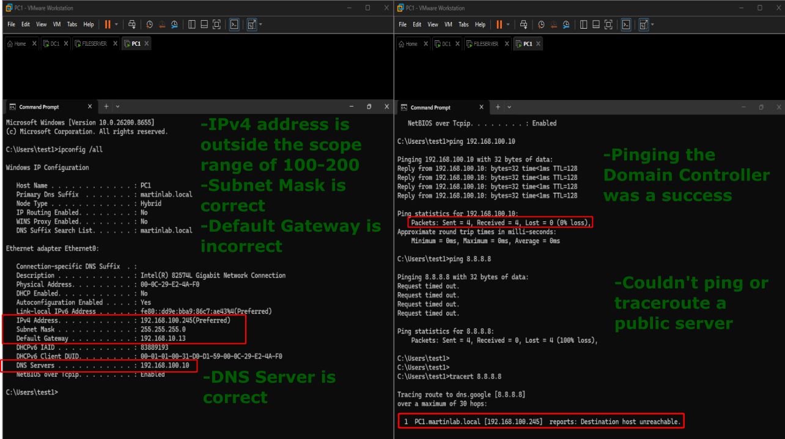
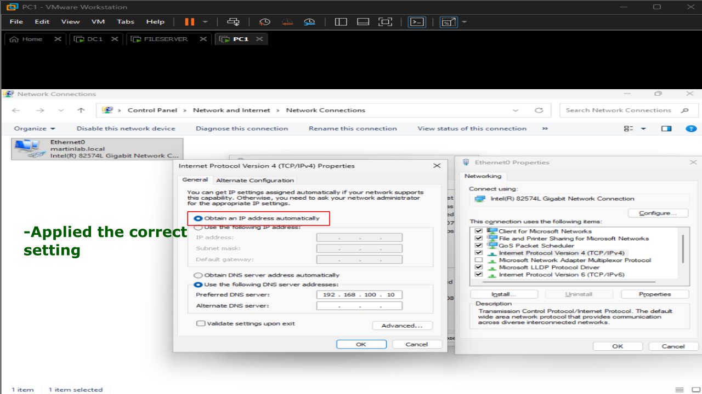
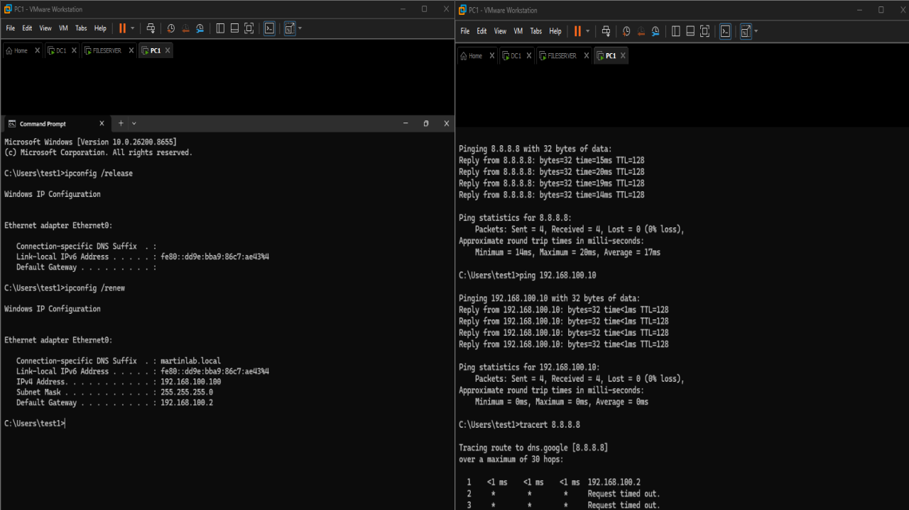

# Static IP Misconfiguration 

## Problem

A Windows 11 client was unable to communicate outside of the local network after its network adapter was manually configured with an incorrect static IP configuration instead of using DHCP.

## Symptoms

- No internet connectivity.
- Unable to reach external websites.
- Unable to access some domain resources.
- Local communication may work depending on the IP configuration.
- Network icon appeared connected but network access was limited.



## Investigation

1. Reviewed the client's network configuration using: ipconfig /all
2. Observed that the network adapter was configured with a manually assigned static IP address instead of obtaining its settings automatically from DHCP.
3. Verified the incorrect configuration by checking: IP Address, Default Gateway, Subnet Mask, DNS Server.
4. Tested connectivity using:
```cmd
ping 192.168.100.10 (Domain Controller)
ping 8.8.8.8
tracert 8.8.8.8
```


## Commands Used

```cmd
ipconfig /all
ping 192.168.100.10 
ping 8.8.8.8
tracert 8.8.8.8
ipconfig /release
ipconfig /renew
```

## Root Cause

The network adapter had been manually configured with an incorrect static IP configuration, preventing proper communication with the network and internet.

## Resolution

Navigated to: Network and Internet -> Network and Sharing Center -> Change Adapter settings -> Properties -> Internet Protocol Version 4 (TCP/IPv4) and applied these settings:

- Obtain an IP address automatically
- Obtain DNS server address automatically

Renewed the DHCP lease to receive the correct network configuration.



## Verification

- Client received a valid DHCP address.
- Correct Default Gateway and DNS Server were assigned.
- Successfully pinged internal and external hosts.
- Internet connectivity and domain resources were restored.


