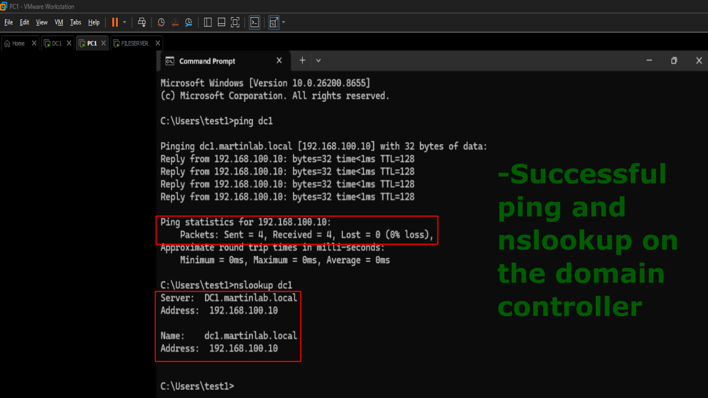
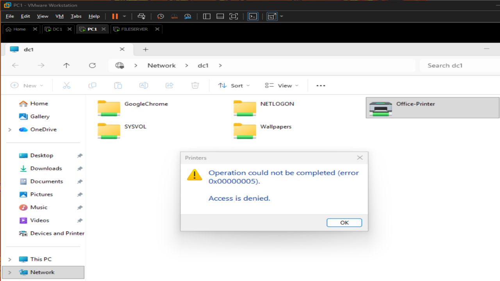
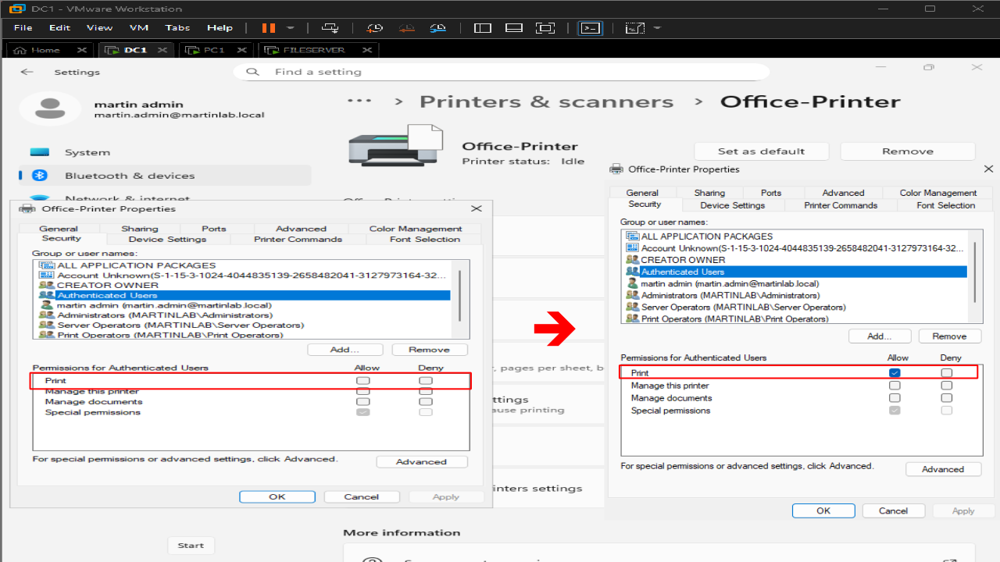
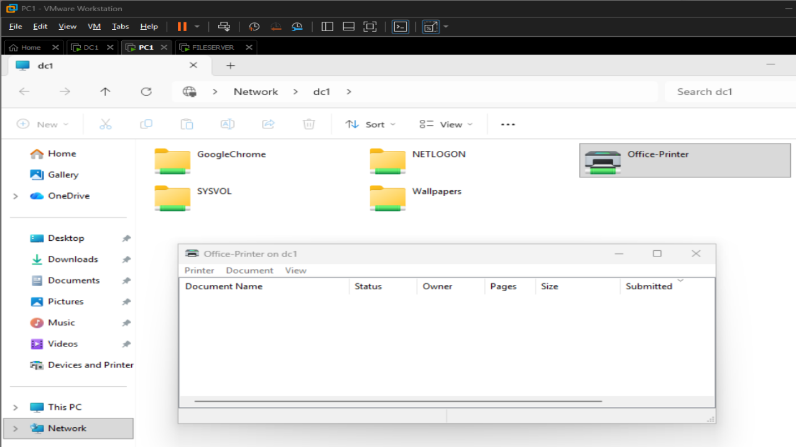
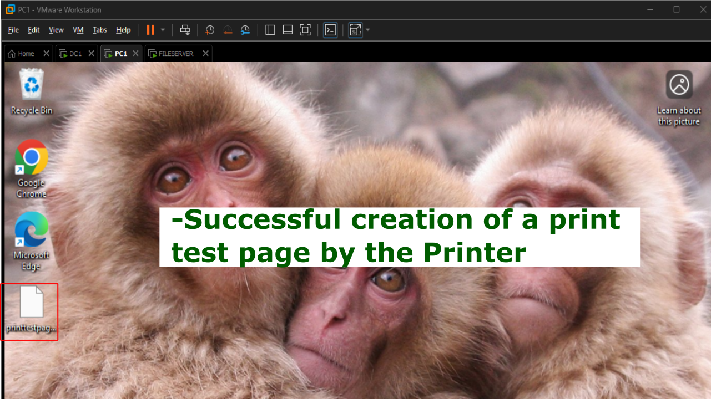

# Missing Print Share Permissions

## Problem

Users report they can see the printer but not able to access it. They can not print.

## Symptoms

- Printer share appears unavailable
- Printer installation fails
- User receives, 'Windows cannot connect to the printer' or 'Access is denied.'

## Investigation

1. Verified network connectivity by pinging the domain controller.
2. Verified DNS by running nslookup on the domain controller.


3. Tested the printer share by going to \\DC1 and clicking on the printer.
4. Recieved "Access is denied."


5. Checked permissions on the domain controller by going to: Printer Properties -> Security -> Authenticated Users
6. Noticed that the print permission is unchecked.


## Commands Used
```
ping dc1
nslookup dc1 
sc query spooler
sc qc spooler
\\dc1
```

## Root Cause

The permissions set on the printer for 'Domain Users' had the print option unchecked. 

## Resolution

Restored print permissions by going to: Printer Properties -> Security -> Authenticated Users -> add 'Print' -> Apply.

## Verification

- On \\dc1, the client was able to access the printer.
- Test print page was successful.



