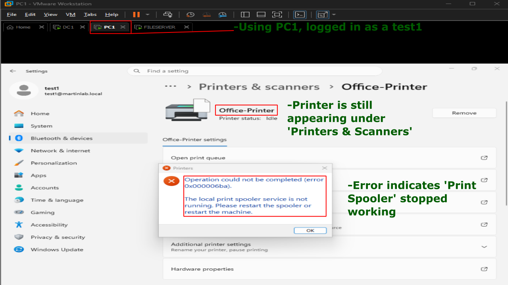
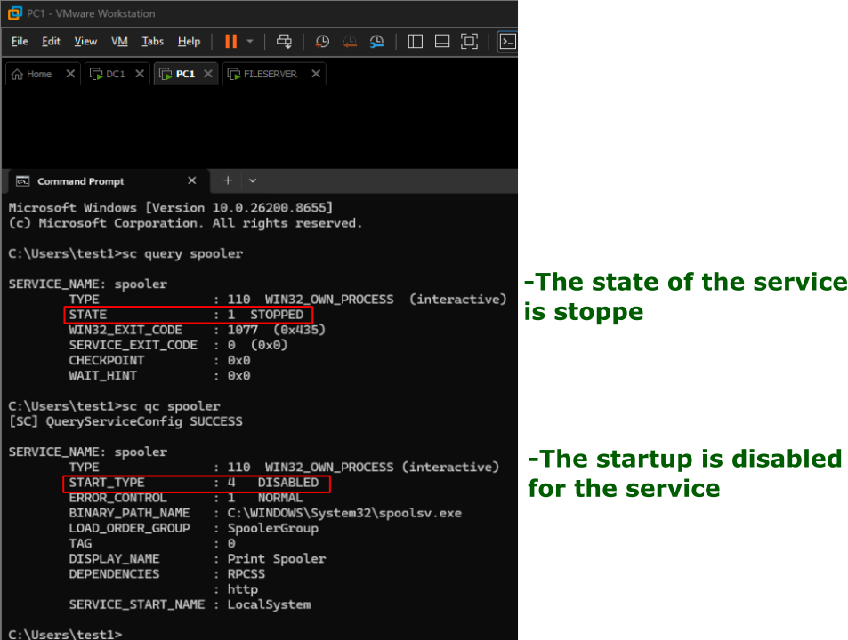
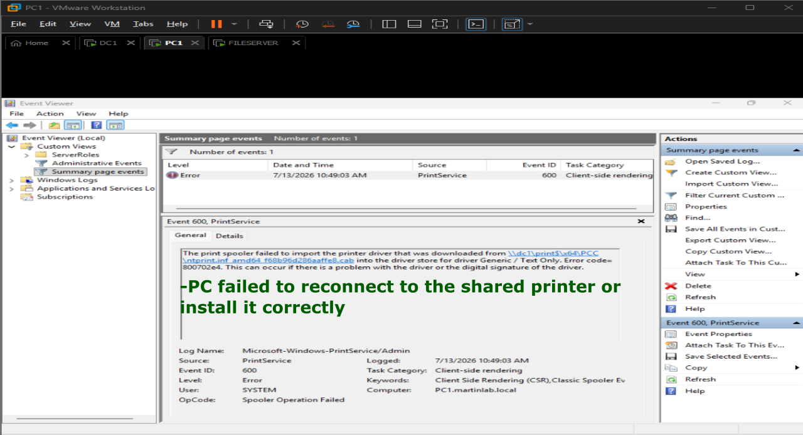
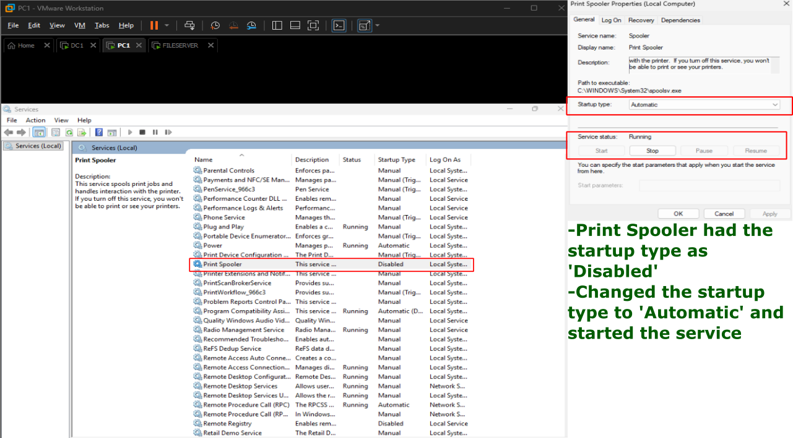
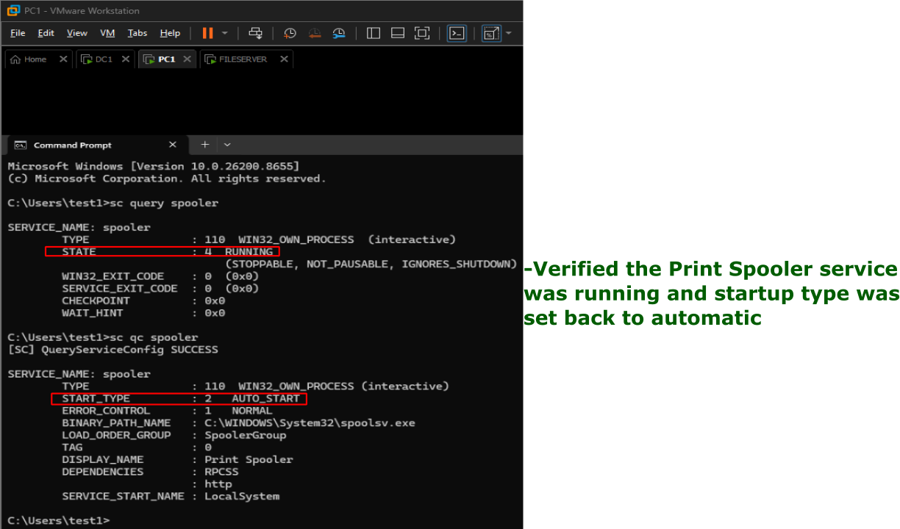
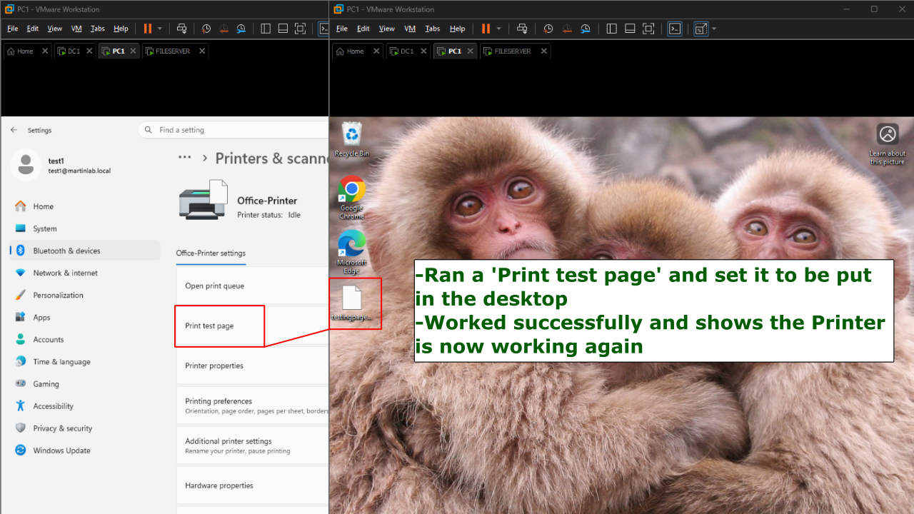

# Print Spooler Malfunction

## Problem

Users were unable to print from a Windows 11 client. Print jobs failed immediately, and printer remained installed but unresponsive.

## Symptoms

- Nothing prints.
- Printer shows offline.
- Print jobs dissapear.
- Test page fails.
- Word says 'Windows cannot connect to the printer.' or 'Operation could not be completed.'

## Investigation

1. Verified the printer exists under 'Printers & Scanners.'


2. Attempted a test page and it failed with the error 'The local print spooler service is not running. Please restart the spooler or restart the machine.'


3. Opened CMD and ran the following commands to verify:
```
sc query spooler = 'STOPPED'
sc qc spooler = 'DISABLED'
```


4. Checked Event Viewer to verify and saw the following error: 'The print spooler  failed to import the printer driver...'


5. Ran services.msc on administrator mode and navigated to 'Print Spooler.'
6. The status was 'disabled.'


## Commands Used
```
sc query spooler
sc qc spooler
```

## Root Cause

The Print Spooler service had been disabled and was not running, preventing Windows from processing print jobs.

## Resolution

Changed the Print Spooler service startup type to 'Automatic' and started the service.


## Verification

- Confirmed the Print Spooler service status was 'RUNNING.'
- Successfully printed a Windows test page.
- Verified normal printer functionality.




