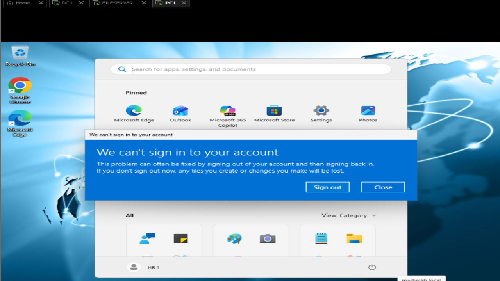
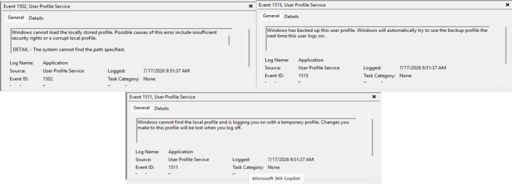
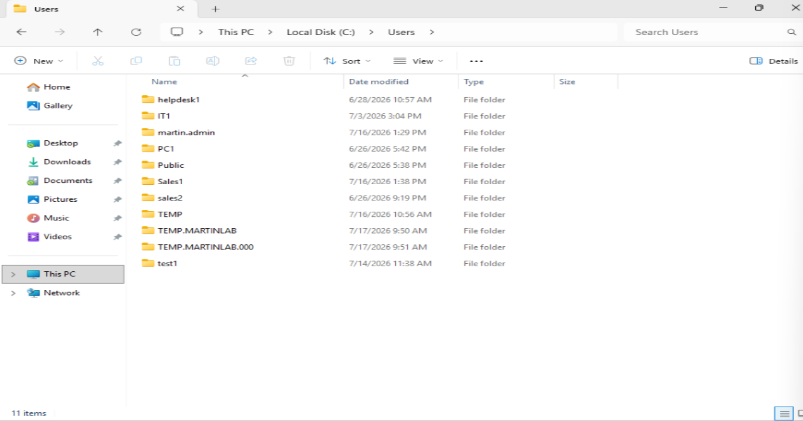
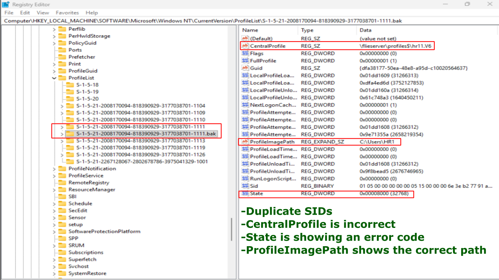
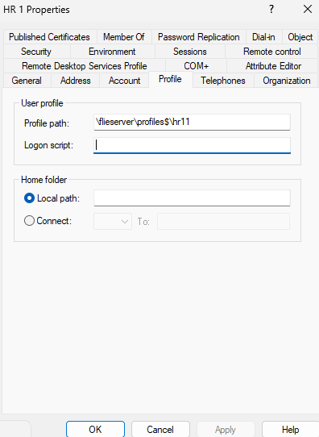
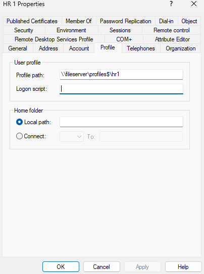
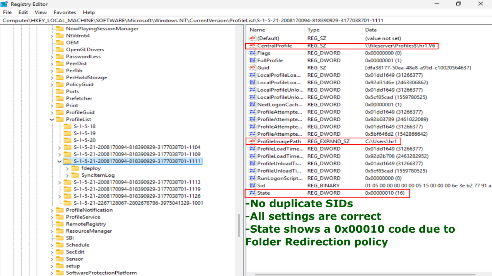

# Roaming Profile Failure

## Problem

A domain user (HR1) in PC1 is configured with a roaming profile path in Active Directory, but instead it is given a temporary profile.

## Symptoms
- HR1 user logs in but roaming profile does not load.
- Error "We can't sign in to your account" is given.
- Event Viewer shows User Profile Service errors.
- Profile path in AD points to a nonexistent path.



## Investigation

1. Opened Event Viewer and navigated to: Windows Logs -> Application.
2. Noticed 3 errors from User Profile Service.



3. Navigated to C:\Users and verified there is no local profile for HR1 user.



4. Checked the UNC path manually by running: \\fileserver\profiles$.
5. Verified it is working successfully as the profile folder appears 'hr1.v6.'
6. Opened Registry Editor and Navigated to: HKEY_LOCAL_MACHINE -> Software -> Microsoft -> Windows NT -> CurrentVersion -> ProfileList.
7. Noticed a '.bak' SID and another duplicate SID.
8. Noticed the 'CentralProfile' on the '.bak' SID points to the incorrect path at: \flieserver\profiles$\hr11.v6. 




9. The correct path should be: \fileserver\profiles$\hr1.v6. 
10. On Active Directory, Opened Active Directory Usrs and Computers, and Navigated to: martinlab.local -> HR OU -> HR1 -> Properties -> Profile
11. Verified that the Profile path is incorrect.




## Commands Used
```
whoami
net use
eventvwr
ping
regedit
```

## Root Cause

THe roaming profile path in Active Directory is set to an invalid UNC path, such as: \\flieserver/profiles$\hr1.

The server path can't be reached and there is no local profile so a temporary profile is created in its place.

## Resolution

1. Corrected the roaming profile path: \\fileserver\profiles$hr1.




2. Logged on PC1 as martin.admin user.
3. Navigated to Registry Editor to the SID keys for HR1 user.
4. Deleted the TEMP SID key and removed '.bak' from the original.
5. Renamed the CentralProfile path to: \fileserver\profiles$\hr1.v6.




6. Logged off as martin.admin.
7. Logged back in as HR1 user.

## Verification

- HR1 logs in with no temporary profile.
- A clean C:\Users\HR1 folder is created.
- Retgistry ProfileList has no.bak, State=0, RefCount=0
- The roaming profile folder hr1.v6 exists and updates.
- ADUC profile path is correct.
