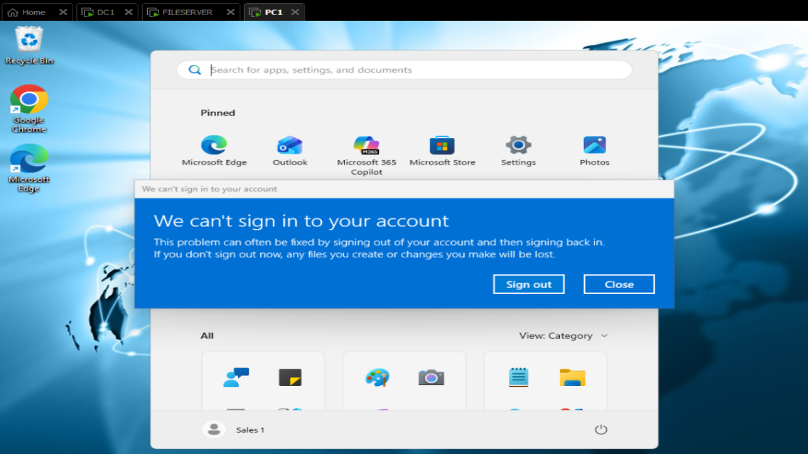
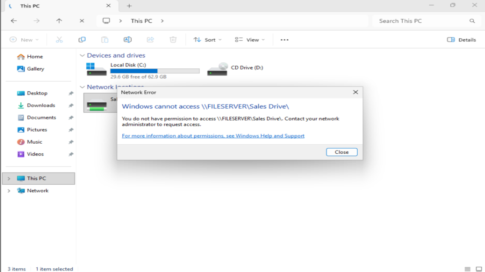
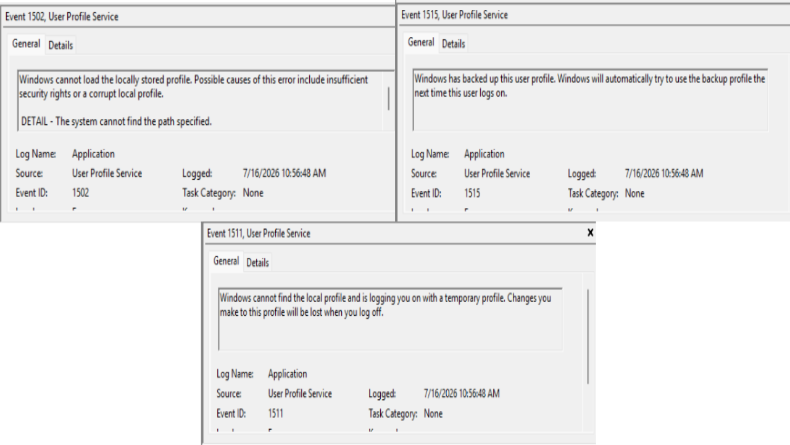
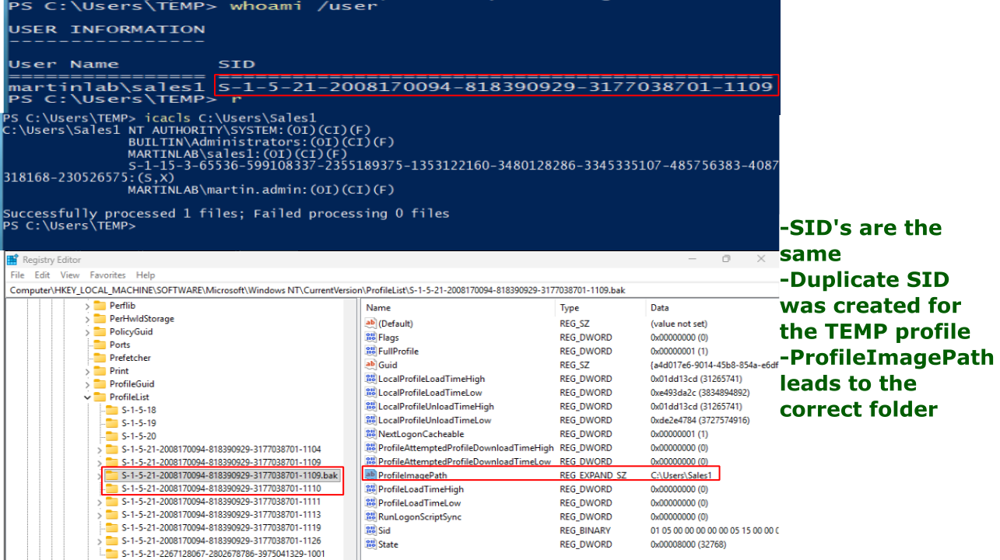
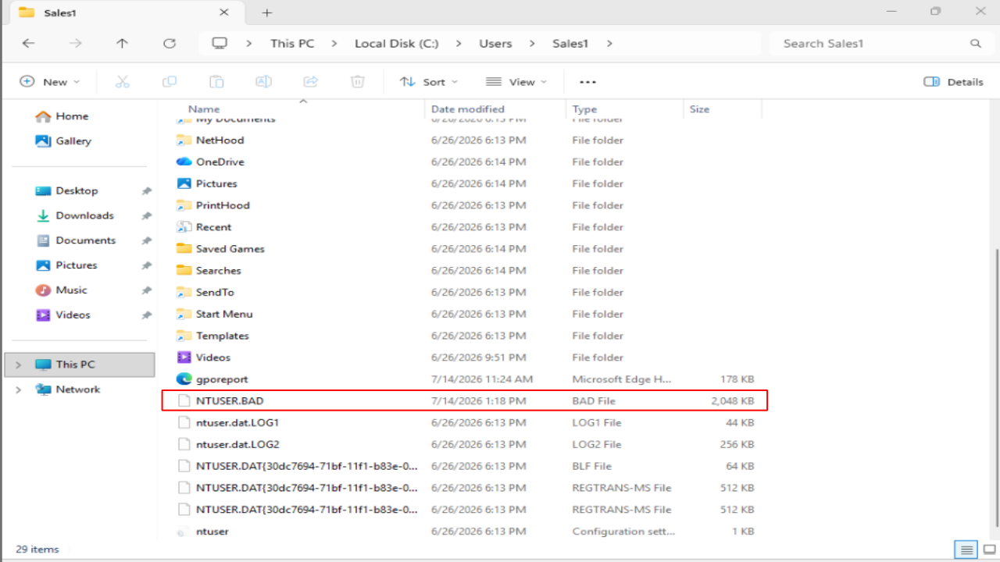
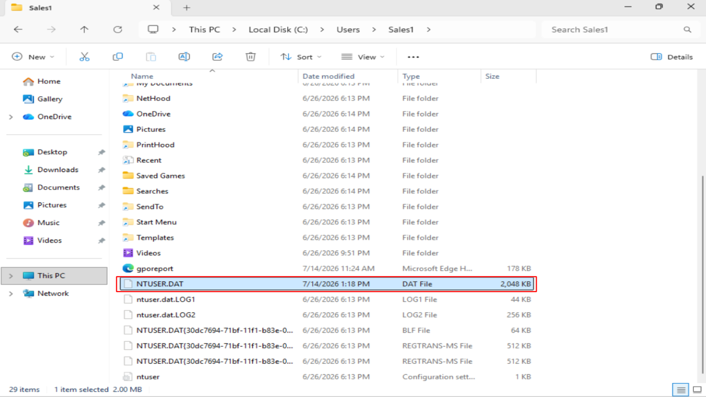
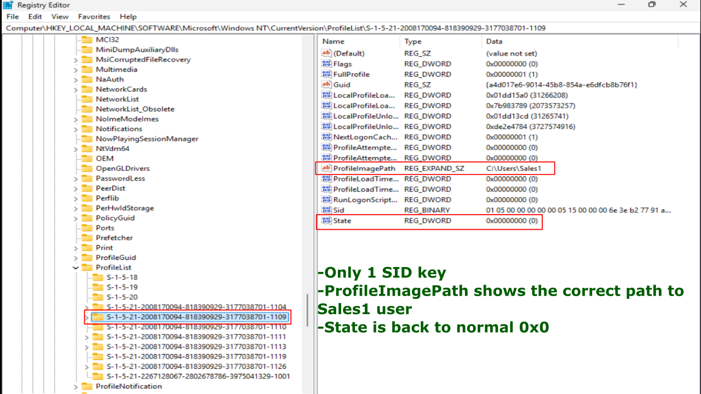
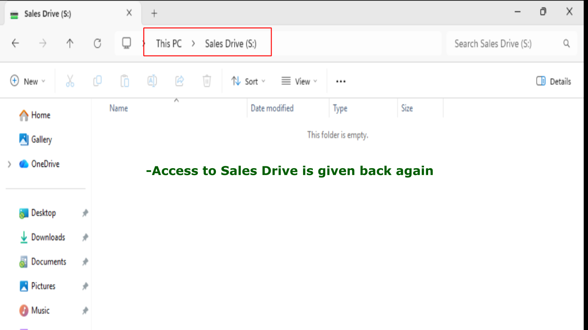

# Temporary Profile Issue

## Problem

The Sales1 user logs in and receives a temporary profile instead of their normal profile.

## Symptoms

- Notification: "We can't sign in to your account."
- Desktop resets to defaults.
- Documents, Desktop, Downloads appear empty.
- Changes do not persist after logoff.
- Event Viewer shows profile load errors.

## Investigation

1. Noticed the error message: "We can't sign in to your account."



2. Verified that files are missing in the home screen and can't access the Drive Map.



3. Checked Event Viewer and navigated to: Windows Logs -> Application
4. Noticed 3 User Profile Service errors confirming a temporary profile was created for this account.



5. Ran the following 2 commands on powershell:
```
icacls C:\Users\Sales1
whoami /user
```
7. Verified Sales1 user had full control of the profile and retrieved the SID key.
8. Navigated: Registry Editor -> HKLM -> Software -> Microsoft -> Windows NT -> Current Version -> ProfileList -> SID
9. Noticed a duplicate SID had been made and the original ended with '.bak'



10. Noticed the State being 0x0008 error and the ProfileImagePath was correct.
11. Confirmed Windows could not locate the required profile registry hive.
12. Navigated to 'C:\Users\Sales1' and verified a 'TEMP' folder was created.
13. Inside the 'Sales1' folder, Clicked Options -> View Tab
```
Checked: 'Show hidden files, folders, and drives'
Unchecked: 'Hide protected operating system files (Recommended).'
```
14. Discovered that 'NTUSER.DAT' file had been renamed to 'NTUSER.BAD'



## Root Cause

Sales1 user's 'NTUSER.DAT' file had been renamed to 'NTUSER.BAD'

Profile could not load so it created a temporary one.

## Resolution

1. Logged in with martin.admin administrator account on PC1.
2. Navigated back to C:\Users\Sales1
3. Renamed 'NTUSER.BAD' to 'NTUSER.DAT'



4. Navigated to Registry Editor, and removed '.bak' from the original SID.



4. Logged off.
5. Sales1 user logged in.
6. Verified the normal user profile loaded successfully.

## Verification

- User logged into their normal profile.
- Desktop icons and personal files were restored.
- No temporary profile notifications appeared.
- User settings persisted after logging off and back on.



